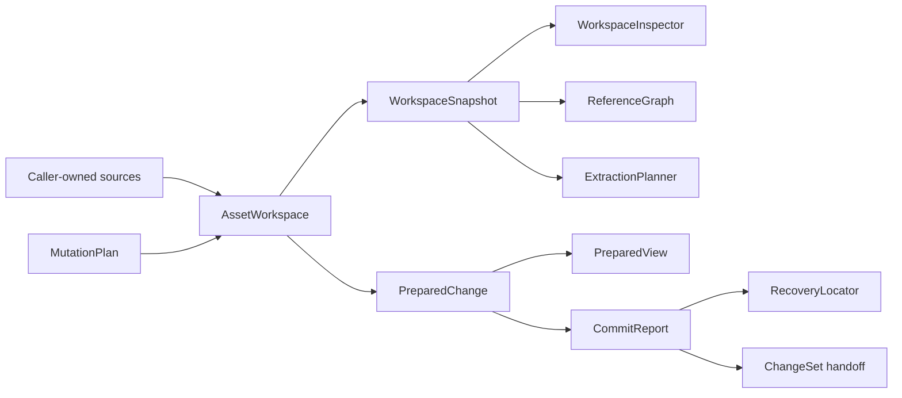

# unity-asset

`unity-asset` is a Rust toolkit for inspecting, indexing, extracting, and making guarded changes
to Unity YAML and binary assets. It supports revision-bound workflows over YAML documents,
SerializedFiles, AssetBundles, WebFiles, ZIP/APK archives, and streamed resource files.

The project is under active development. It is suitable for tooling, research, and controlled
asset pipelines, but it does not claim full Unity serialization coverage or replace the Unity
Editor.

## Design

The high-level API is built around one authoritative aggregate:



The main invariants are:

- `AssetWorkspace` is the only public mutation owner.
- `WorkspaceSnapshot` and `PreparedView` are immutable and revision-bound.
- `SourceLocator` and `ObjectAddress` are portable logical identities; in-process handles also
  carry workspace and revision context.
- `MutationPlan` stores ordered, guarded intent. It performs no writes.
- `prepare` performs a complete, zero-durable-write proof and returns an opaque
  `PreparedChange`.
- `PreparedChange` is not serializable and cannot be reconstructed from a report. `commit`
  consumes it.
- Publication is journaled and currently reports
  `CommitAtomicity::PerArtifactRecoverable`.
- Automation uses versioned structured contracts. Display text is never an input protocol.

See [ADR 0004](docs/adr/0004-asset-workspace-transactions.md) for the transaction model and
[the migration guide](docs/MIGRATING_TO_ASSET_WORKSPACE.md) for breaking API and CLI changes.

## Workspace Layout

```text
crates/
  unity-asset-core/          Identity, revisions, budgets, values, diagnostics
  unity-asset-yaml/          Unity YAML parser and serializer internals
  unity-asset-binary/        AssetBundle, SerializedFile, WebFile, TypeTree
  unity-asset-write/         Wire-faithful encoders and prepared artifacts
  unity-asset-decode/        Optional audio, texture, and sprite codecs
  unity-asset/               Workspace, references, extraction, schema recipes
  unity-asset-search-core/   Search query and ranking policy
  unity-asset-search-index/  Revisioned derived index and generation store
apps/
  unity-asset-cli/           Typed workspace and extraction CLI
  unity-asset-search-daemon/ Local search service
  unity-asset-search-cli/    Search service client
```

Rust does not make transitive crates directly importable. Depend on `unity-asset` for the
high-level workflow. Add `unity-asset-binary`, `unity-asset-write`, or `unity-asset-decode`
directly only when using their low-level APIs.

## Capabilities

### Inspection

- Immutable source and object projections through `WorkspaceInspector`
- Stable source identities across nested containers
- Format metadata for SerializedFiles, AssetBundles, WebFiles, archives, YAML, and streamed data
- Typed six-state lookup results: resolved, unloaded, missing, ambiguous, invalid, or null where
  the domain supports null
- Caller-owned `AssetLoadBudget` across parsing, decompression, traversal, and result retention

### References

- One revision-bound `ReferenceGraph` for YAML and binary pointers
- Incoming, outgoing, root, leaf, closure, and cycle queries
- Structured resolution facts and diagnostics
- Deterministic JSON, JSON Lines, and DOT projections
- The same graph interface over committed snapshots and prepared previews

### Mutation and Publication

- Versioned, canonical `MutationPlan` contracts
- Guarded field, reference, schema, resource, sequence, and explicitly unsafe raw replacement
- Schema recipes for higher-level Unity operations
- Transactional prepare with independent artifact reparse
- Read-your-writes inspection through `PreparedView`
- Compare-and-swap checks over source fingerprints and destination state
- Journaled publication, deterministic recovery, and structured `CommitReport`

### Extraction

- Versioned `ExtractionRequest`, `ExtractionPlan`, `ExtractionManifest`, and `ExtractionReport`
- Explicit object, bundle-container, and reference-traversal selection
- Deterministic relative paths and artifact ordering
- Resumable manifests and bounded execution
- Optional decoded audio, texture, and sprite output with the `decode` feature

### Search

- Rebuildable, generation-based local search index
- Stable result ordering, fuzzy matching, suggestions, and reverse references
- Transaction- and revision-bound `ChangeSet` handoff after commit
- Atomic generation switching keeps readers on the previous complete generation if rebuilding
  fails

## Installation

```toml
[dependencies]
unity-asset = "0.3.0"
```

Add optional low-level crates only when needed:

```toml
[dependencies]
unity-asset-binary = "0.3.0"
unity-asset-write = "0.3.0"
unity-asset-decode = { version = "0.3.0", features = ["audio", "texture-advanced"] }
```

Install the command-line tools:

```bash
cargo install unity-asset-cli
cargo install unity-asset-search-daemon
cargo install unity-asset-search-cli
```

## Library Quick Start

Load one explicit source, freeze a snapshot, and inspect typed projections:

```rust,no_run
use unity_asset::AssetLoadBudget;
use unity_asset::workspace::{AssetWorkspace, WorkspaceInspector};

fn main() -> Result<(), Box<dyn std::error::Error>> {
    let mut budget = AssetLoadBudget::default();
    let mut workspace = AssetWorkspace::new()?;
    workspace.load_path("game.bundle", &mut budget)?;

    let snapshot = workspace.snapshot();
    let inspector = WorkspaceInspector::new(&snapshot);

    for source in inspector.sources(&mut budget)? {
        println!(
            "{:?}: {} encoded bytes",
            source.source().kind(),
            source.encoded_length()
        );
    }

    for object in inspector.objects(&mut budget)? {
        let class = object.object().class();
        println!(
            "{:?}: {} ({})",
            object.address(),
            class.class_name(),
            class.class_id()
        );
    }

    Ok(())
}
```

Library source loading is explicit. Applications that scan a project directory should apply
their own trust and ignore policy, then call `load_source` with a stable `SourceAlias` for each
selected root source. The CLI provides a budgeted directory-discovery policy for command-line
use.

External JSON, TPK, or AssetRipper `InfoJson` TypeTree registries are immutable workspace options:

```rust,no_run
use unity_asset::AssetLoadBudget;
use unity_asset::workspace::{AssetWorkspace, WorkspaceOptions};

fn main() -> Result<(), Box<dyn std::error::Error>> {
    let mut budget = AssetLoadBudget::default();
    let options = WorkspaceOptions::lenient()
        .with_type_tree_registry_paths(
            &["typetree.json", "unity.tpk", "AssetRipper/InfoJson"],
            &mut budget,
        )?;
    let mut workspace = AssetWorkspace::with_options(options)?;
    workspace.load_path("game.bundle", &mut budget)?;
    Ok(())
}
```

Prepare, inspect the candidate revision, and publish the exact proven artifacts:

```rust,no_run
use std::path::Path;

use unity_asset::AssetLoadBudget;
use unity_asset::workspace::{
    AssetWorkspace, CommitReport, MutationPlan, PrepareOptions, PublicationTarget,
    WorkspaceInspector,
};

fn publish(
    workspace: &mut AssetWorkspace,
    plan: MutationPlan,
    publication_root: &Path,
    budget: &mut AssetLoadBudget,
) -> Result<CommitReport, Box<dyn std::error::Error>> {
    let prepared = workspace.prepare(plan, PrepareOptions::default(), budget)?;

    let preview = prepared.view();
    let _candidate_objects = WorkspaceInspector::new(&preview).objects(budget)?;

    let target = PublicationTarget::in_place(publication_root)?;
    Ok(workspace.commit(prepared, target, budget)?)
}
```

The publication root must already exist, be absolute, and satisfy the platform containment
checks. Persist `CommitReport` and `RecoveryLocator`, not `PreparedChange`.

## Typed CLI

The installed binary is `unity-asset`. Workspace commands emit JSON to stdout and diagnostics to
stderr. Structured inputs accept a JSON file or `-` for stdin.

Discover the exact workspace subcommands routed by the installed binary, together with their JSON
inputs, stdout contracts, stdin limits, and filesystem prerequisites:

```bash
unity-asset workspace capabilities
```

This emits `unity_asset.workspace_cli_capabilities` v1. It intentionally describes only the CLI
surface; use the Rust `workspace_capabilities()` API when embedding the broader library workflow.

Inspect a file or a directory of supported sources:

```bash
unity-asset workspace inspect sources --input tests/samples
unity-asset workspace inspect objects --input tests/samples
unity-asset workspace inspect object \
  --input tests/samples \
  --address-json object-address.json
```

Inspect every matching `AssetBundle.m_Container` occurrence with a versioned query:

```json
{"contract":"unity_asset.bundle_container_query","version":1,"pattern":"Assets/"}
```

```bash
unity-asset workspace inspect bundle-containers \
  --input tests/samples \
  --query-json container-query.json
```

Validate and execute a mutation plan:

```bash
unity-asset workspace plan validate --plan mutation-plan.json
unity-asset workspace prepare --input tests/samples --plan mutation-plan.json
unity-asset workspace preview \
  --input tests/samples \
  --plan mutation-plan.json \
  --address-json object-address.json
unity-asset workspace commit \
  --input tests/samples \
  --plan mutation-plan.json \
  --publication-root /absolute/output-root
```

`prepare` prints a report. It cannot transfer commit authority to another process. `preview` and
`commit` therefore reopen the trusted inputs and re-run prepare from the same canonical plan.

Discover and handle durable recovery evidence:

```bash
unity-asset workspace recover discover --publication-root /absolute/output-root
unity-asset workspace recover resume --locator-json recovery-locator.json
unity-asset workspace recover abandon --locator-json recovery-locator.json
unity-asset workspace recover finalize \
  --input tests/samples \
  --locator-json recovery-locator.json
```

Build a bounded reference projection:

```bash
unity-asset references graph \
  --input tests/samples \
  --max-facts 200000
```

Plan or execute deterministic extraction:

```bash
unity-asset export \
  --input tests/samples \
  --output out \
  --request extraction-request.json \
  --dry-run

unity-asset export \
  --input tests/samples \
  --output out \
  --plan extraction-plan.json \
  --manifest manifest.json
```

The low-level bundle adapter and a YAML-only extraction convenience command remain available:

```bash
unity-asset list-bundle --input game.bundle --filter CAB-
unity-asset split-yaml --input scene.unity --output split
```

`split-yaml` is a thin profile over the canonical extraction contracts. It emits the standard
`unity_asset.extraction_report`, writes `extraction-manifest.json`, and uses the same recoverable
publication journal as `export`; it does not maintain a second YAML-specific report contract.

Use global parsing policy before the subcommand:

```bash
unity-asset \
  --strict \
  --show-warnings \
  --typetree-registry typetree.json \
  workspace inspect objects --input tests/samples
```

## Limitations

- Unity formats are versioned and not fully documented. Unsupported layouts fail explicitly.
- Write support targets existing supported schemas and containers; arbitrary asset authoring is
  out of scope.
- Runtime TypeTree callbacks are not accepted. Use immutable, budgeted JSON, TPK, or AssetRipper
  `InfoJson` registries.
- Decoding is best effort and feature-gated. Raw extraction remains available when a codec is
  unavailable.
- Publication does not promise cross-file atomic visibility. Each replacement is atomic and the
  complete set is recoverable through its journal.
- Runtime IDs, revision-bound handles, and reports are workspace-specific. Portable addresses and
  fingerprints must still be resolved or validated against the intended snapshot; do not splice
  runtime values across workspaces or revisions.

## Development

```bash
git clone https://github.com/Latias94/unity-asset.git
cd unity-asset
cargo build --workspace
cargo nextest run --workspace
```

Examples and integration tests use the sample assets in `tests/samples`. Release procedures are
documented in `docs/RELEASING.md`.

## Acknowledgments

The implementation learns from [UnityPy](https://github.com/K0lb3/UnityPy),
[AssetRipper](https://github.com/AssetRipper/AssetRipper),
[unity-rs](https://github.com/yuanyan3060/unity-rs), and
[unity-yaml-parser](https://github.com/socialpoint-labs/unity-yaml-parser). They are references,
not runtime dependencies.

## License

MIT. See [LICENSE](LICENSE).
