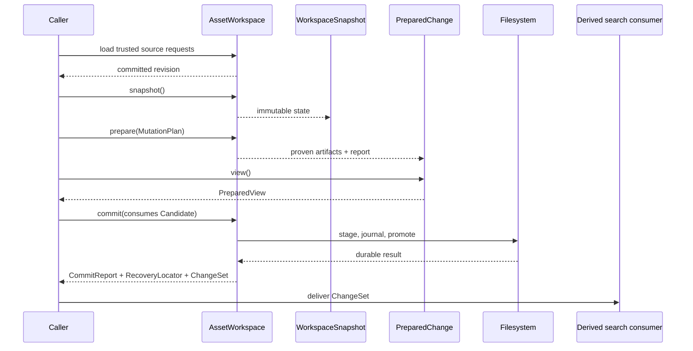

# ADR 0004: Asset Workspace ownership and recoverable publication

- Status: Accepted
- Date: 2026-07-26

## Context

Unity asset operations cross several physical and logical boundaries:

- one root file may contain archives, WebFiles, AssetBundles, SerializedFiles, and streamed data;
- object-local identifiers are not globally unique;
- reads, reference resolution, extraction, and mutation must agree on one source graph and
  revision;
- multi-source changes can require rebuilding ancestor containers;
- publication can be interrupted after some files have reached their destinations;
- human callers, CLI automation, and agents need the same structured interface.

A mutable facade over public maps cannot prove that all reads describe one revision. Direct
format-specific save operations also cannot coordinate source fingerprints, prepared artifacts,
ancestor rewrites, destination conflicts, recovery evidence, and derived search refresh.

## Decision

Use `AssetWorkspace` as the authoritative aggregate for source ownership, revision advancement,
prepare, commit, and recovery.

### Aggregate and identity

- A workspace has a stable `WorkspaceId` and a monotonically advancing `WorkspaceRevision`.
- Every loaded source belongs to the aggregate and has a `SourceId`, `SourceLocator`,
  `SourceFingerprint`, and `SourceKind`.
- Portable intent uses `SourceLocator` and `ObjectAddress`.
- In-process object handles additionally bind the workspace and revision, preventing accidental
  cross-snapshot use.
- Nested source containment is owned by the workspace catalog rather than reconstructed by each
  consumer.

### Immutable read boundaries

- `WorkspaceSnapshot` retains the exact committed state observed when it was created.
- A snapshot never begins observing a later commit.
- `WorkspaceInspector`, `ReferenceGraph`, and extraction accept the sealed `WorkspaceView`
  interface.
- `PreparedView` implements the same read interface over one fully proven candidate revision.

### Mutation lifecycle

1. A versioned `MutationPlan` records ordered intent, source expectations, guards, and
   content-addressed payloads.
2. `prepare` validates workspace identity, revision, fingerprints, addresses, schemas, references,
   resources, artifact paths, and destination observations.
3. Prepare builds the complete artifact graph, reparses the exact prepared images independently,
   and performs no durable writes.
4. Success returns `PreparedChange`, an opaque authority containing the proven candidate and
   publication evidence.
5. Callers inspect `PreparedChange::view()` before deciding whether to publish.
6. `commit` consumes the authority, rechecks compare-and-swap conditions, writes the journal,
   publishes the exact prepared bytes, and advances the in-memory baseline.

`PreparedChange` is intentionally neither serializable nor reconstructible from `PrepareReport`.
A report is evidence for a caller; it is not publication authority. A process boundary must carry
the canonical plan and re-run prepare.

### Publication and recovery

`PublicationTarget` establishes an existing absolute containment root and binds its directory
identity. Commit stages artifacts on the destination filesystem, verifies their digests, records
ordered journal evidence, and promotes each artifact.

The current atomicity contract is:

- `PerArtifactRecoverable`: each individual replacement is atomic; the artifact set may be
  temporarily partially promoted, but the journal contains enough validated evidence to resume or
  roll back safely.

The implementation does not claim cross-file atomic visibility.

Recovery is split deliberately:

- `discover_recoveries` inventories canonical candidates without opening source paths;
- `recover_at` resumes filesystem publication from a caller-supplied `RecoveryLocator`;
- `abandon_at` rolls back an unfinished transaction when journal evidence proves that it is safe;
- `finalize_recovery_at` attaches the recovered result to a workspace reopened from caller-trusted
  source configuration.

Finalized journals remain immutable historical receipts. Recovery never treats journal paths as
authority to open arbitrary external files.

### Agent and transport parity

The Rust API, CLI, daemon adapters, and automation use the same versioned domain contracts:

- capability catalog;
- source and object inspections;
- object addresses and mutation plans;
- prepare, commit, and recovery reports;
- reference projections;
- extraction requests, plans, manifests, and reports;
- committed `ChangeSet` values handed to derived search consumers.

Transport adapters may format these contracts but do not add capabilities. They do not parse
`Display` output and do not dispatch an untyped command string inside JSON.

### Flow

## Consequences

### Benefits

- Inspection, references, extraction, and mutation share one identity and revision model.
- Prepared reads describe the exact bytes later consumed by commit.
- Stale sources, stale revisions, changed destinations, and cross-workspace values fail as typed
  errors before unsafe publication.
- Recovery survives process interruption without serializing in-memory authority.
- Derived search failures cannot roll back an authoritative asset commit.
- Automation receives stable structured fields instead of scraping human text.

### Costs

- Callers must carry explicit budgets, workspace identities, revisions, and source expectations.
- A successful prepare may be expensive because it proves and independently reparses complete
  output images.
- CLI commit re-runs prepare because prepared authority cannot cross the process boundary.
- Multi-artifact publication requires journals, staging space, filesystem identity checks, and an
  operational recovery path.
- Low-level format writers remain available but do not inherit workspace transaction guarantees.

## Alternatives Considered

### Mutable all-in-one facade

Keep public maps and mutable object access, then let callers coordinate reads and writes.

- Advantage: fewer types and less setup for small scripts.
- Rejected: callers can combine unrelated revisions, bypass source expectations, and publish
  partial container rewrites.

### Serializable prepared session

Serialize enough state after prepare for another process to commit without re-preparing.

- Advantage: cheaper two-process prepare/commit workflows.
- Rejected: a serialized bearer token cannot retain live filesystem identities, source backing,
  compare-and-swap observations, and one-use authority safely. Revalidation would recreate prepare
  under a less explicit name.

### Direct save per format

Expose independent YAML, SerializedFile, AssetBundle, and WebFile save operations as the primary
write API.

- Advantage: simple ownership inside each parser.
- Rejected: nested container changes require one artifact graph and one publication transaction.
  Format-local saves cannot prove ancestor consistency or recover a multi-file set.

### Generic command bus

Represent every operation as `{ "command": "...", "args": ... }` and route it through one
dispatcher.

- Advantage: one transport endpoint.
- Rejected: it erases compile-time contracts, makes versioning coarse, encourages agent-only
  behavior, and turns capability discovery into string matching.

## Risks and Mitigations

| Risk | Severity | Likelihood | Mitigation |
| --- | --- | --- | --- |
| Prepare uses excessive memory on large containers | High | Medium | Caller-owned budgets, segmented prepared artifacts, explicit artifact limits, independent characterization |
| Filesystem interruption leaves partial promotion | High | Medium | Same-filesystem staging, ordered journal events, recoverable atomicity, resume and abandon paths |
| Stale or malicious recovery evidence redirects IO | Critical | Low | Caller-supplied locator, no-follow containment, directory identity checks, bounded versioned journal parsing |
| Public contracts drift between Rust and CLI | High | Medium | Shared DTOs, canonical JSON, capability catalog, subprocess conformance tests |
| Derived search falls behind committed state | Medium | Medium | Transaction-keyed `ChangeSet`, idempotent consumer, generation barrier, reconciliation rebuild |
| Callers mistake reports for authority | High | Low | `PreparedChange` has no serialization contract; commit consumes the concrete value |

## Success Criteria

| Criterion | Target | Verification |
| --- | --- | --- |
| One public mutation lifecycle | No direct mutable aggregate or format-save bypass in the high-level crate | Public-symbol and call-site audit |
| Revision honesty | Every inspection, reference, extraction, prepare, and commit result carries or validates workspace revision context | Integration contract tests |
| Prepared authority confinement | No `Serialize`, `Deserialize`, or reconstruction API for `PreparedChange` | Compile-time API tests and capability catalog |
| Zero-write prepare | No durable target or journal changes before commit | Filesystem observation tests |
| Recoverable publication | Every injected journal interruption reaches a deterministic resume, rollback, or typed blocked state | Recovery fault matrix |
| Structured automation parity | CLI workflow completes capability, inspect, plan, prepare, preview, commit, recover, reference, and extraction steps without parsing display text | Subprocess JSON conformance suite |
| Deterministic contracts | Repeated canonical plans, reports, and manifests are byte-identical for identical inputs | Golden canonical JSON tests |

## Implementation Status

The aggregate, immutable views, mutation plan, prepared authority, journaled commit, recovery
workflow, capability catalog, reference graph, extraction contracts, and search handoff are
implemented. Format and schema coverage remain incremental.
