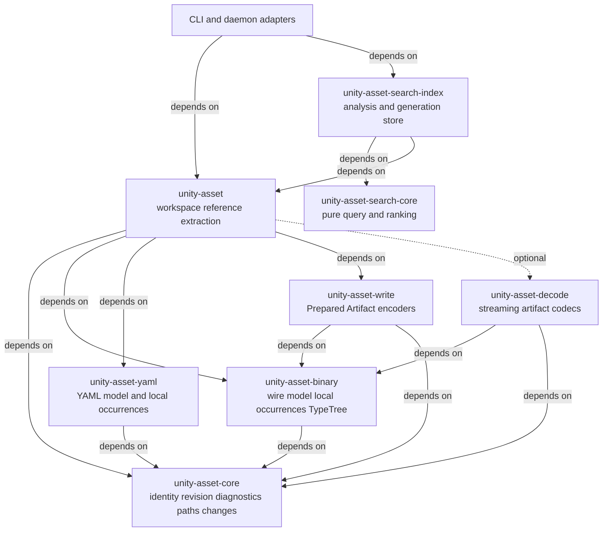
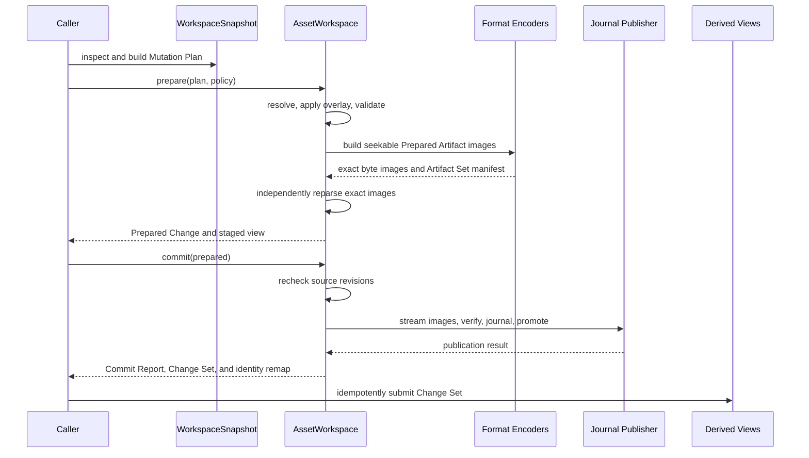
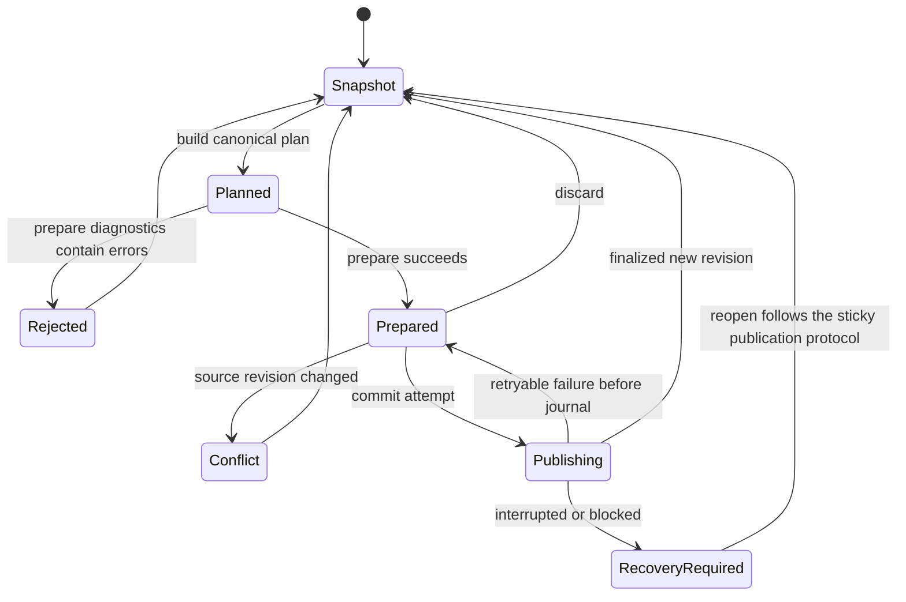
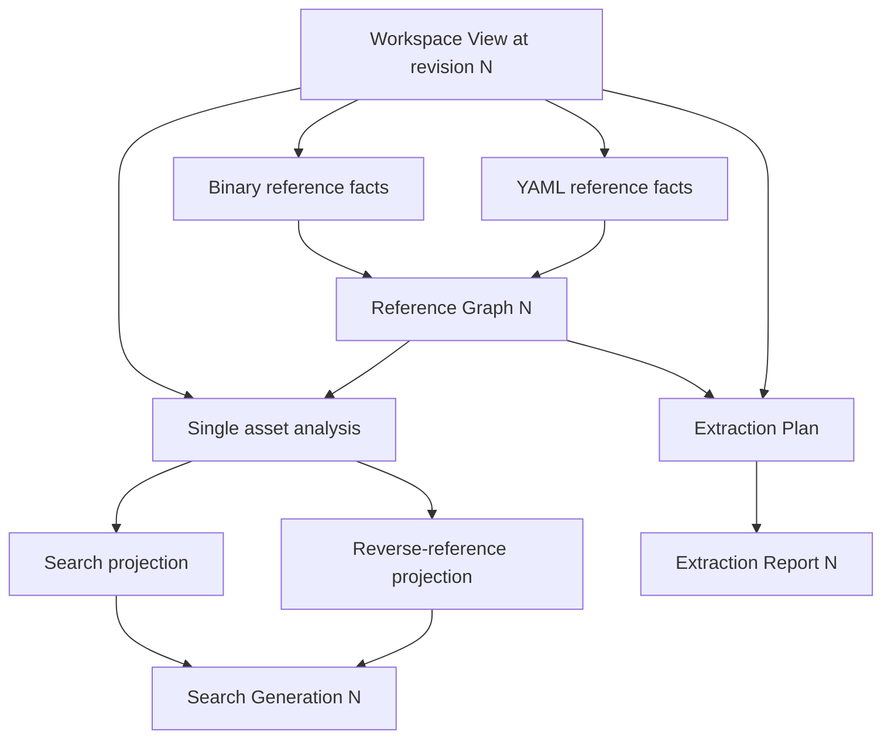
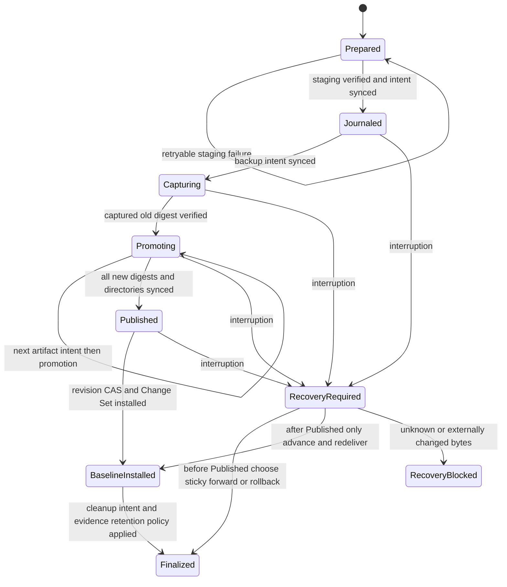
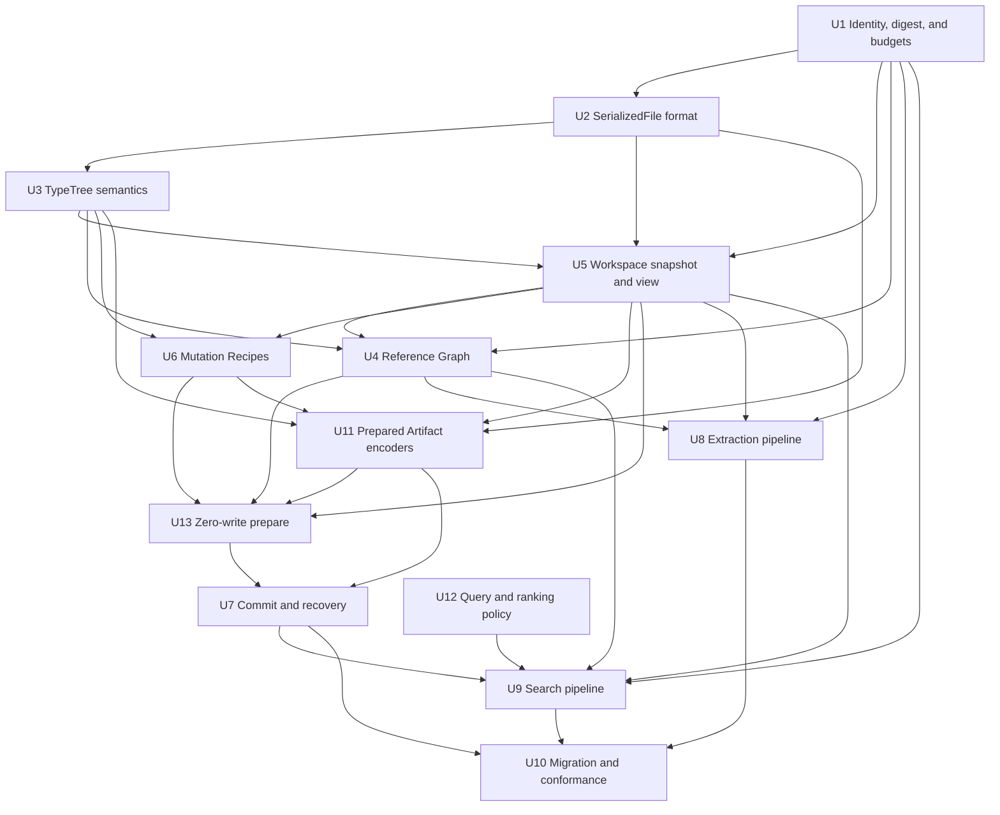

# Fearless Unity Asset Architecture - Plan

## Goal Capsule

| Field | Contract |
|---|---|
| Objective | Replace the current field-bag identities, partial edit state, duplicated format logic, graph scans, export workflows, and search orchestration with deep modules that are correct by construction and usable through one structured interface. |
| Authority | This plan overrides compatibility with the current public edit and graph interfaces. ADR 0001-0003 remain authoritative for Search Everything, Tantivy, the localhost daemon, and the separate Unity plugin repository. |
| Execution profile | Breaking refactor, characterization-first around wire formats, deletion of shallow modules, focused commits in dependency order, and continuous nextest verification. |
| Stop conditions | Stop for a real contradiction with an ADR, an independently verified Unity wire fixture, or a platform guarantee that the plan claims but the operating system cannot provide. Do not stop for downstream compatibility with interfaces explicitly scheduled for deletion. |
| Tail ownership | ce-work owns implementation, focused verification, simplification, review, commits, and final workspace-wide quality gates under the active goal. |

---

## Product Contract

### Summary

Build one revisioned Asset Workspace for inspection, planning, prepare/preview, read-your-writes, commit, recovery, reference analysis, extraction, and Search Everything projections. Preserve mature format and performance depth while deleting public surfaces whose complexity disappears under the deletion test.

### Problem Frame

The repository has strong format implementations, but their invariants are split across shallow interfaces. BinaryObjectKey permits invalid source combinations. EnvironmentEditSession forwards into mutable Environment state, and different query paths see different pending data. Callback, encoding, streamed-resource, and save failures can leave cached mutations, orphan CAB prefixes, extra externals, or partially published outputs. A successful save does not advance the loaded baseline, so a later save can lose an earlier edit.

SerializedFile parsing and writing duplicate version rules while the public model discards wire fields. TypeTree parse, scan, write, and template rewrite interpret the same schema independently and have already drifted on alignment, managed references, pair shapes, and unsigned values. Binary and YAML references are scanned repeatedly into several graph types. Two CLI export commands each own an entire extraction workflow. Search Everything rereads assets for multiple projections and commits its search index, reverse-reference index, and state in separate generations.

The intended users are both Rust developers and automation, including AI agents used during game development. The correct response is not an agent-specific facade. The normal public interface must be structured, discoverable, deterministic, safely preparable, and diagnostic-rich enough that human code, CLI adapters, daemons, and agents can compose the same primitives.

### Actors

- A1. Rust library caller - loads projects, inspects assets, plans edits, extracts artifacts, and commits results.
- A2. Automation caller - CLI, daemon, build tooling, or AI agent that requires serializable intent, stable identities, structured diagnostics, and deterministic reports.
- A3. Format maintainer - extends Unity version and TypeTree support without updating mirrored read, scan, write, and graph implementations.
- A4. Search consumer - expects search hits and reverse references from one committed Search Generation.

### Requirements

#### Identity, State, And Commit

- R1. Replace Environment as the mutable public editing surface with an Asset Workspace whose immutable snapshots and prepared overlays provide one read view for object queries, PPtr resolution, reference queries, and extraction.
- R2. Make invalid source ownership and object identity combinations unrepresentable; pathID remains signed and is never treated as globally unique.
- R3. Provide versioned, serializable Object Addresses, Mutation Plans, structured diagnostics, prepare reports, Change Sets, commit reports, extraction plans, and extraction reports without creating an agent-only interface.
- R4. Prepare is the sole public preflight operation. Its validation phase must produce a complete affected-source and Artifact Set report without durable filesystem writes; failures leave the committed snapshot and staged view unchanged.
- R5. Commit must detect source-level revision conflicts, consume and verify every exact Prepared Artifact without re-encoding, validate safe destinations, publish through a durable journal, expose the achieved atomicity level, support deterministic recovery, and advance the in-memory baseline on success.

#### Wire And Schema Correctness

- R6. Store all supported SerializedFile wire semantics required for faithful rewrite, including raw type identity, destroyed and stripped flags, object-level script metadata where applicable, and implicit version capabilities.
- R7. Use one validated TypeTree semantic schema for read, skip/scan, write, and template rewrite while preserving zero-allocation PPtr scanning, numeric-array fast paths, and original-byte template preservation.
- R8. Replace per-field YAML and binary setters with semantic Mutation Recipes that validate class, schema, version, field variants, reference shapes, hierarchy invariants, and streamed-resource placement before lowering to generic mutations.

#### References, Extraction, And Search

- R9. Build one revision-bound Reference Graph from binary and YAML adapters; each edge records source identity, field path, raw target, resolution state, resolved target, and diagnostics.
- R10. Build one extraction deep module that plans stable object selection, representation, paths, streamed data, dependent object reads, resume state, and artifact status before concurrent execution.
- R11. Make full, changed-path, and sharded Search Everything reindexing share one asset analysis pipeline, multiple projections, one Search Generation commit, and one query/ranking policy.
- R12. Propagate Workspace Revision or Search Generation through Reference Graph, extraction, and search results so callers can detect stale derived views and obtain read-your-writes after commit.

#### Architecture And Quality

- R13. Preserve real seams with multiple adapters: YAML/binary source adapters, TypeTree registry adapters, format execution adapters, extraction selection/content adapters, and Unix/Windows publication behavior.
- R14. Do not introduce a public filesystem trait, agent trait, string command bus, or other hypothetical seam with one implementation.
- R15. Delete ChangeTracker, SerializedFileEditSession, TypeTreeProcessor and the incomplete binary pseudo-writer, duplicate TypeRegistry, redundant graph facades/scanners, duplicate export command implementations, and other proven pass-through public surfaces.
- R16. Verify behavior through the new module interfaces with wire golden tests, UnityPy differential tests, corpus tests, failure injection, deterministic concurrency tests, and black-box automation workflows.

### Key Flows

- F1. Inspect and edit
  - **Trigger:** A caller opens an Asset Workspace and inspects an object.
  - **Actors:** A1, A2
  - **Steps:** Snapshot returns identity plus revision; caller builds a Mutation Plan; workspace prepares it; caller inspects the prepared view; commit publishes and returns a Change Set.
  - **Outcome:** Every read path observes one revision, and the same plan is reproducible by Rust, CLI, or automation.
- F2. Reference and extraction
  - **Trigger:** A caller requests references, a graph closure, or exported artifacts.
  - **Actors:** A1, A2
  - **Steps:** YAML and binary adapters emit normalized facts; Reference Graph resolves them; selected Object Identities enter the extraction planner; executor produces a deterministic report.
  - **Outcome:** Reference scanning is not repeated by each caller, and extraction does not rebuild the graph implicitly.
- F3. Commit and recovery
  - **Trigger:** A Prepared Change is committed or an unfinished journal exists when a workspace opens.
  - **Actors:** A1, A2
  - **Steps:** Recheck fingerprints; stage and hash all outputs; journal backups and promotion; finalize the new revision; on interruption, reopen and deterministically roll forward or roll back.
  - **Outcome:** No pre-encoding failure changes targets, and any publication interruption is explicit and recoverable.
- F4. Search generation
  - **Trigger:** Full scan, changed paths, a committed Change Set, watcher notification, or reconciliation.
  - **Actors:** A4
  - **Steps:** Analyze each affected asset once; project search and reference documents; write a new generation; atomically switch generation metadata; execute one ranking policy.
  - **Outcome:** Main search, reverse references, state, and status describe the same source revision.

### Acceptance Examples

- AE1. Given a serialized-file address with a bundle index, or a bundle-member address without a member identity, deserialization rejects it before any lookup.
- AE2. Given two SerializedFiles with the same pathID, inspection returns distinct Object Identities and resolves each object to its owning source.
- AE3. Given a multi-operation plan whose later mutation fails, prepare returns ordered diagnostics and neither the committed snapshot nor a prepared overlay contains any mutation from that failed plan.
- AE4. Given an AudioClip that only has m_StreamData, replacing its payload writes exactly one CAB payload at offset zero; a missing or invalid target field leaves no CAB bytes or external entry.
- AE5. Given a legacy SerializedFile with non-default raw type, destroyed, stripped, and TypeTree metadata, a one-object edit preserves all untouched wire semantics after independent reparse.
- AE6. Given a schema with size-node alignment, pairs, repeated ManagedReferencesRegistry nodes, nested managed references, and UInt64 above i64::MAX, read, scan, write, and template rewrite consume the same extent and preserve the value.
- AE7. Given a prepared cross-source PPtr retarget, object read, outgoing references, incoming references, and graph traversal all resolve the staged target before commit.
- AE8. Given a source changed after planning, prepare or commit rejects it with expected and actual source fingerprints and performs no target promotion.
- AE9. Given a failure after one journal promotion step, reopening the Asset Workspace reports the transaction and deterministically restores or finishes a coherent Artifact Set.
- AE10. Given the same extraction request with one worker or many workers, plans, relative paths, statuses, diagnostics, digests, and canonical manifest bytes are identical.
- AE11. Given one Search Generation build where reverse-reference projection fails, readers continue using the previous complete generation rather than mixing old and new indexes.
- AE12. Given an automation caller using only public structured interfaces, it can inspect capabilities, rename an object, retarget a PPtr, replace streamed data, prepare, preview, commit, recover, query references, extract an artifact, and search the committed result without parsing display text.

### Success Criteria

- Invalid identity states have no public-field construction path.
- Exactly one public mutation lifecycle remains; closure mutation and direct mutable Environment escape hatches are gone.
- All supported SerializedFile version branches are expressed through one capability vocabulary used by read and write.
- One Reference Graph serves outgoing, incoming, closure, cycle, CLI, prepared-view, and search projection queries.
- One export command and one extraction manifest schema replace the duplicated bundle and serialized workflows.
- Full, changed, and sharded indexing invoke one per-asset analysis and publish one generation.
- Rust and versioned typed-JSON CLI workflows expose the same capability, prepare, commit, recovery, reference, extraction, and search contracts without a string command bus.
- Focused, workspace, feature-matrix, differential, deterministic, and recovery gates pass.

### Scope Boundaries

#### In Scope

- All eight architecture-review candidates and the proven deletion list.
- Breaking Rust and CLI interface changes, including renaming Environment to AssetWorkspace without a compatibility type alias.
- New versioned structured data contracts where automation requires persistence or inspection.
- An ADR for workspace transaction and publication semantics.

#### Deferred to Follow-Up Work

- A lossless Unity YAML syntax model that preserves scalar style, tags, anchors, and null spelling beyond the semantics needed by this plan.
- A generated Rust class hierarchy covering all Unity versions.
- Runtime third-party source adapter registration.
- Network collaboration, CRDT merge, or field-level automatic conflict resolution.
- Long-term cross-major compatibility for persisted Mutation Plans.
- A standalone reusable benchmark program for multi-gigabyte bundles after correctness and streaming interfaces land. U11's representative and generated-large decision gate remains in scope.

#### Outside This Product's Identity

- LLM, prompt, MCP, or natural-language logic inside core crates.
- Moving the Unity Editor plugin into this repository.
- Replacing Tantivy or changing the localhost daemon decision in ADR 0001.
- Merging the distinct YAML document-splitting command in apps/unity-asset-cli/src/commands/extract.rs solely because it shares the word extract.

---

## Planning Contract

### Assumptions

- The user confirmed the complete candidate set and explicitly accepts breaking changes and deletion, so no compatibility facade is required.
- Object Identity is stable only inside an Asset Workspace namespace and Workspace Revision. Cross-module calls use a Revisioned Object Handle, persisted intent uses Object Address plus base revision, and commit reports are the only bridge across revisions.
- Optimistic conflict detection is source-grained. Two plans touching the same physical source conflict even when their object fields do not overlap.
- The default commit target creates a new output tree. In-place or merge publication is explicit and reports recoverable per-artifact atomicity rather than claiming cross-file atomic visibility.
- Mutation Plan serialization is versioned for the current library major line; future cross-major migration is not part of this plan.
- unity-asset owns Asset Workspace, Reference Graph, and extraction orchestration. No workspace or extraction crate is added unless implementation proves an actual dependency cycle.
- repo-ref/UnityPy and repo-ref/assetripper are behavioral and ownership references, not runtime dependencies.

### Key Technical Decisions

- KTD1. Use a snapshot-and-capability workspace interface. AssetWorkspace opens and recovers sources, returns immutable WorkspaceSnapshots, and uses prepare as its sole public preflight operation. Prepare turns a canonical Mutation Plan into a one-use PreparedChange and exposes its staged view and report; commit consumes it into a CommitReport. This keeps the common flow direct without collapsing inspect and prepare into a tagged request/result pair.
- KTD2. Separate logical identity from physical origin and bind every in-process handle to context. Core owns opaque SourceId, ObjectId, ObjectAddress, RevisionedObjectHandle, FieldPath, revisions, diagnostics, and Change Set vocabulary. AssetWorkspace owns its namespace, SourceCatalog resolution, and source nesting. Reference Graph, extraction, and search never accept a bare ObjectId.
- KTD3. Persist generic mutations, not recipes. Mutation Recipes are pure lowering implementations for meaningful Unity operations; the serialized plan contains guarded field, reference, schema, resource, and explicitly unsafe raw replacements.
- KTD4. Treat prepare as full semantic proof with zero durable writes. It applies operations transactionally to a copy-on-write overlay, resolves schemas and references, validates paths and collisions, and builds a budgeted, seekable Prepared Artifact byte image. The independent parser reparses that exact image before prepare succeeds. Before this policy is frozen, representative and adversarial scale fixtures must establish a documented supported-workload ceiling. If the COW image or generated compressed chunks exceed the declared memory and byte budgets within that envelope, prepare rejects the plan rather than weakening proof or creating a hidden spool.
- KTD5. Treat commit as publication, not another encoding or mutation phase. Commit consumes the exact Prepared Artifact images, rechecks source and destination fingerprints under a publication guard, streams them once to same-filesystem staging while verifying their digests, journals capture and promotion, advances the in-memory baseline through revision CAS, and exposes DirectoryAtomic or PerArtifactRecoverable. PublicationTarget owns a deterministic destination-parent recovery namespace, and recovery can reconstruct and idempotently redeliver the canonical CommitReport, Change Set, and identity remap after any acknowledged or unacknowledged completion.
- KTD6. Put SerializedFile version capabilities and wire-faithful state in unity-asset-binary. The parser and unity-asset-write encoder remain two adapters over one format vocabulary; the write crate does not reconstruct discarded state.
- KTD7. Normalize TypeTree once, execute it several ways. A validated semantic schema owns primitive aliases, arrays, pairs, PPtrs, alignment, managed references, and unsigned widths; specialized read, scan, write, and rewrite adapters preserve their performance implementations.
- KTD8. Make Reference Graph edges first-class facts without reversing Cargo dependencies. Binary and YAML crates emit format-local occurrences; unity-asset adapters bind them to Revisioned Object Handles and normalized Reference Facts. Source-fingerprint fact caches and revision/catalog resolution caches are separate; traversal, incoming/outgoing projection, cycles, and diagnostics live behind one module interface.
- KTD9. Keep extraction in unity-asset. It needs AssetWorkspace identity, PPtr, streamed-resource resolution, and optional decode adapters. Creating another crate would add a shallow re-export and complicate feature ownership without a dependency-cycle benefit.
- KTD10. Keep codecs in unity-asset-decode and output ownership in extraction. Audio, texture, sprite, and other codecs write to caller-owned streaming sinks or return explicitly bounded small artifacts; they do not create directories or own manifests. Extraction uses weighted concurrency and backpressure over estimated bytes, open files, and in-flight reports.
- KTD11. Treat Search Everything as a rebuildable derived read model with explicit internal interfaces. search-core owns pure query, tokenization, ranking, fallback, stable order, and explanation policy. The analysis pipeline maps scan intent to one revision-bound asset analysis; the workspace adapter supplies projections; the generation store owns Tantivy, reverse references, manifest, and atomic switching; the daemon owns admission and coalescing.
- KTD12. Replace instead of layer. Old tests are retained only as characterization until equivalent interface tests pass, then shallow interfaces and their internal-state tests are deleted in the same implementation unit.
- KTD13. Keep authoritative commit and derived consumers decoupled but revision-honest. U7 returns a revision- and transaction-keyed Change Set in CommitReport and never calls graph or search consumers. CLI and daemon adapters deliver it to U9's idempotent coordinator; watcher and reconciliation recover missed delivery. A committed asset revision is never rolled back because derived refresh fails, and every derived result retains its actual revision and stale marker.
- KTD14. Treat every asset and recovery artifact as untrusted input. A shared AssetLoadBudget bounds positive counts, bytes, recursion, members, decompression totals, and expansion ratios before allocation or decode; checked arithmetic is mandatory. Journals are versioned untrusted documents whose paths and identities are revalidated relative to their transaction root before every recovery action.
- KTD15. Use one versioned byte-identity contract. DigestV1 is BLAKE3-256 over logical bytes plus an unambiguous length domain, serialized as a tagged fixed 32-byte value. Source fingerprints, plan and artifact digests, journal old/new digests, extraction content digests, and Search Generation inputs use it; filesystem identity remains separate and size/mtime are cache hints only.

### High-Level Technical Design

#### Compile-Time Module Dependencies

#### Mutation And Commit Sequence

#### Workspace Lifecycle

#### Derived Data Flow

#### Publication Journal

### Phased Delivery

| Phase | Units | Exit condition |
|---|---|---|
| Foundation | U1, U2, U3, U5, U12 | Identity, digests, load budgets, wire state, TypeTree semantics, mutation data contracts, immutable base views, and ranking policy are independently testable. |
| Workspace correctness | U4, U6, U11, U13, U7 | References, recipes, exact Prepared Artifacts, prepare, and publication use one revisioned staged view. |
| Derived capabilities | U8, U9 | Extraction and search consume the new identities and revisioned facts without duplicate orchestration. |
| Surface completion | U10 | Old interfaces are absent, adapters are thin, docs are current, and black-box workflows pass. |

### Implementation Dependency Graph

### Alternative Approaches Considered

- Keep Environment and validate BinaryObjectKey constructors. Rejected because callers would still learn and propagate source-kind and optional-index combinations, so the module would remain shallow.
- Put full physical paths inside ObjectId. Rejected because output relocation and repacking would change logical identity and leak ownership rules.
- Create unity-asset-workspace or unity-asset-extract crates. Rejected for now because unity-asset is already the dependency apex that combines YAML, binary, write, and optional decode; another package would primarily re-export the real implementation.
- Use only open, evaluate, and commit. Rejected because combining inspection and prepare into one tagged interface reduces common-call ergonomics without hiding additional implementation.
- Expose a highly extensible public adapter registry. Rejected because current source variation is known and internal; third-party format adapters are hypothetical.
- Preserve old public interfaces through deprecated wrappers. Rejected because the user authorizes breaking changes and wrappers would retain two mutation lifecycles.
- Model the filesystem as a public trait. Rejected because there is one local filesystem implementation; tempfile and child-process failpoints test the real implementation.
- Generate all Unity typed classes before building recipes. Rejected because it expands scope and public interface before the semantic traversal and transaction foundations are trustworthy.

### Deletion Ownership

Temporary bridges are implementation-only and must be crate-private. No public compatibility wrapper may survive its deletion owner.

| Superseded surface | Deletion owner |
|---|---|
| TypeTreeProcessor, incomplete binary serialize_object, unused TypeTreeBuilder, typetree-local duplicate TypeRegistry | U3 |
| EnvironmentDependencyGraph, EnvironmentObjectGraph duplicate adjacency, metadata placeholder graph, independent reverse scanners | U4 |
| Per-field typed/YAML setters | U6 |
| allow_missing_fields, PackerOptions wrapper, output_name_for_source, writer filesystem conveniences | U11 |
| ChangeTracker, changed booleans, SerializedFileEditSession, EnvironmentEditSession, EnvironmentWriteState, the temporary Environment public bridge, and direct save/edit escape hatches | U7 |
| Duplicate bundle/serialized export commands and legacy extraction manifests | U8 |
| Search private YAML/binary reference scanners, duplicate full/changed orchestration, query-time source enrichment | U9 |
| BinaryObjectKey, callback reporters, PythonLike facade, and any remaining public migration bridge | U10 |

---

## Implementation Units

### Unit Index

| U-ID | Title | Primary files | Depends on |
|---|---|---|---|
| U1 | Identity, revision, digest, budget, and diagnostics foundation | unity-asset-core/src; unity-asset/src/workspace | None |
| U2 | Wire-faithful SerializedFile format and random-access parse seam | unity-asset-binary/src/asset; unity-asset-write/src/serialized_file | U1 |
| U3 | TypeTree semantic traversal | unity-asset-binary/src/typetree; unity-asset-write/src/typetree | U2 |
| U12 | Search query and ranking policy | unity-asset-search-core | None |
| U5 | Asset Workspace snapshot, view, and Mutation Plan contracts | unity-asset/src/workspace; environment loader/query modules | U1, U2, U3 |
| U4 | Unified Reference Graph kernel | unity-asset/src/reference; old environment graph modules | U1, U3, U5 |
| U6 | Schema Mutation Recipes | unity-asset/src/schema; typed and YAML UI modules | U3, U5 |
| U11 | Prepared Artifact encoders and allocation | unity-asset-write encoders; workspace artifact model | U2, U3, U5, U6 |
| U13 | Zero-write prepare and prepared view | unity-asset/src/workspace/preflight and overlay | U4, U5, U6, U11 |
| U7 | Artifact commit and recovery | unity-asset/src/workspace/commit and journal | U11, U13 |
| U8 | Deterministic extraction pipeline | unity-asset/src/extraction; CLI export commands | U1, U3, U4, U5 |
| U9 | Search Everything generation pipeline | search-index; search daemon | U1, U4, U5, U7, U12 |
| U10 | Public migration and conformance | crate exports, CLI, examples, docs | U7, U8, U9 |

### U1. Establish Identity, Revision, Digest, Budget, And Diagnostic Contracts

**Goal:** Introduce closed, serializable identity, revision, byte-identity, resource-budget, and diagnostic vocabulary at the dependency base, plus a Source Catalog that resolves physical origins without exposing illegal combinations.

**Requirements:** R2, R3, R12, R13, R16; AE1, AE2, AE8.

**Dependencies:** None.

**Files:**

- Create crates/unity-asset-core/src/identity.rs
- Create crates/unity-asset-core/src/revision.rs
- Create crates/unity-asset-core/src/digest.rs
- Create crates/unity-asset-core/src/budget.rs
- Create crates/unity-asset-core/src/diagnostic.rs
- Create crates/unity-asset-core/src/field_path.rs
- Create crates/unity-asset-core/src/change.rs
- Modify crates/unity-asset-core/src/lib.rs
- Modify crates/unity-asset-core/Cargo.toml
- Modify Cargo.toml
- Modify Cargo.lock
- Create crates/unity-asset-core/tests/object_identity.rs
- Create crates/unity-asset-core/tests/digest_and_budget.rs
- Create crates/unity-asset/src/workspace/mod.rs
- Create crates/unity-asset/src/workspace/source_catalog.rs
- Modify crates/unity-asset/src/lib.rs
- Modify crates/unity-asset/src/environment/imp/key.rs
- Modify apps/unity-asset-cli/src/shared.rs

**Approach:** Define opaque workspace-namespaced SourceId and ObjectId variants for YAML and binary objects, RevisionedObjectHandle for module calls, and a validated serializable ObjectAddress for CLI and plan persistence. Add signed IDs, SourceOrigin, WorkspaceRevision, FieldPath, Diagnostic, Change Set, AssetLoadBudget, and DigestV1 records. DigestV1 uses BLAKE3-256 over a length-delimited logical-byte domain; SourceFingerprint wraps a DigestV1 plus source-kind contract rather than size/mtime. Keep constructors and deserializers responsible for invariants. The Source Catalog canonicalizes path aliases and owns archive, WebFile, bundle, SerializedFile, and sidecar nesting.

**Execution note:** Start with compile-time and serialization characterization of current key call sites, then replace all direct field construction rather than layering constructors over the field bag. Before dependent units start, run a real fixture through the existing open, edit, repack, relocate, and reopen path and record the continuity and rejection observations that the new ObjectAddress and handle contracts must preserve; treat a contradiction as the identity decision gate.

**Patterns to follow:** Serde data types in unity-asset-core; current length-prefixed key parsing only as evidence for edge cases, not as a compatibility contract; UnityPy ObjectReader ownership and AssetRipper AssetInfo collection ownership as conceptual references.

**Test scenarios:**

1. Round-trip every valid disk, archive-member, WebFile-member, direct SerializedFile, bundle-member, YAML anchor, positive pathID, and negative pathID ObjectAddress through canonical JSON and compact text.
2. Reject direct SerializedFile addresses with bundle membership, bundle objects without a member, malformed tags, invalid UTF-8 boundaries, and pathID coercion to unsigned.
3. Register two SerializedFiles with the same pathID and prove their ObjectIds differ.
4. Register path aliases, case variants under the configured platform policy, and nested members; prove one SourceId per canonical source without collapsing distinct archive entries.
5. Change a source fingerprint and prove WorkspaceRevision changes while cache population alone does not.
6. Sort diagnostics, identities, revisions, and Change Set entries from randomized insertion order and prove canonical bytes are stable.
7. Reject a RevisionedObjectHandle used with another workspace namespace or revision; resolve the equivalent ObjectAddress against the intended snapshot.
8. Repack and relocate a real fixture; prove persisted ObjectAddresses re-resolve through Source Catalog while pre-move RevisionedObjectHandles are rejected, and record the expected identity remap for U7/U10 conformance.
9. Match DigestV1 conformance vectors across streaming and contiguous inputs, reject unknown digest tags, and prove size/mtime changes without byte changes cannot alter byte identity.
10. Reject zero or nonsensical AssetLoadBudget configurations and prove checked consumption for counts, bytes, depth, member totals, decompression totals, and expansion ratio is deterministic.

**Verification:** New code accepts ObjectAddress or RevisionedObjectHandle, never bare ObjectId. DigestV1 and AssetLoadBudget have canonical vectors and no competing byte-identity or parser-budget vocabulary is introduced. A temporary legacy key bridge is crate-private and has U10 as its deletion owner; core tests and migrated CLI key parsing pass.

### U2. Build A Wire-Faithful SerializedFile Format Module

**Goal:** Give parser and writer one version capability vocabulary, retain every wire field needed for faithful rewrite, and expose a crate-private random-access parse seam that can validate segmented Prepared Artifacts without materialization.

**Requirements:** R6, R13, R15, R16; AE5.

**Dependencies:** U1.

**Files:**

- Create crates/unity-asset-binary/src/asset/format.rs
- Modify crates/unity-asset-binary/src/asset/header.rs
- Modify crates/unity-asset-binary/src/asset/parser.rs
- Modify crates/unity-asset-binary/src/asset/types.rs
- Modify crates/unity-asset-binary/src/asset/mod.rs
- Modify crates/unity-asset-binary/src/reader.rs
- Modify crates/unity-asset-binary/src/shared_bytes.rs
- Modify crates/unity-asset-binary/src/data_view.rs
- Modify crates/unity-asset-binary/src/bundle/parser.rs
- Modify crates/unity-asset-binary/src/webfile.rs
- Modify crates/unity-asset-binary/src/typetree/parser.rs
- Modify crates/unity-asset-write/src/serialized_file/writer.rs
- Modify crates/unity-asset-write/src/serialized_file/types_write.rs
- Modify crates/unity-asset-write/src/serialized_file/typetree_dump.rs
- Create crates/unity-asset-write/tests/serialized_file_wire_matrix.rs
- Create crates/unity-asset-binary/tests/random_access_parsing.rs
- Modify crates/unity-asset-write/tests/legacy_serialized_v8_roundtrip.rs
- Modify crates/unity-asset-write/tests/corpus_roundtrip.rs
- Modify crates/unity-asset-write/tests/unitypy_e2e.rs

**Approach:** Add explicit version capabilities for headers, metadata, object tables, SerializedType, legacy/blob TypeTree encoding, ref types, and alignment. Make ObjectInfo preserve raw type ID, class ID, type index, destroyed, stripped, and script metadata separately. Treat enableTypeTree as implicit true before version 13. Make legacy TypeTree read/write symmetric, reject negative and over-budget positive counts before allocation, and reject unknown string offsets rather than converting them to empty text. Introduce a crate-private random-access byte source and cursor used by SerializedFile, Bundle, and WebFile validation entry points; contiguous SharedBytes and U11's segmented PreparedArtifact are adapters over that seam.

**Execution note:** Add crafted golden fixtures that fail on the current parser/writer before changing production code. Do not rely only on this repository writing and rereading its own bytes.

**Patterns to follow:** docs/UNITYPY_PARITY.md; repo-ref/UnityPy/UnityPy/files/ObjectReader.py; repo-ref/assetripper/Source/AssetRipper.IO.Files/SerializedFiles/Parser/ObjectInfo.cs; current BinaryReader length limits.

**Test scenarios:**

1. Parse and rewrite golden fixtures at format transitions 2, 3, 5, 7, 8, 10, 11, 12, 13, 16, 17, 19, 20, 21, and 22.
2. Preserve non-default raw type ID, class ID, destroyed, stripped, script index, old type hash, external, user information, and endian metadata while editing one object.
3. Parse a version 8 file with a non-empty TypeTree and object table using implicit TypeTree enablement, write it, and independently reparse it.
4. Reject negative type, object, external, ref-type, node, and string-buffer counts without large allocation.
5. Reject unknown common-string offsets and out-of-range node metadata with a structured format diagnostic.
6. Compare selected outputs with UnityPy and handcrafted expected bytes; use AssetRipper source as a second rule reference where executable differential comparison is unavailable.
7. Prove no-op rewrite and single-object rewrite preserve all untouched object-table and metadata semantics.
8. Parse identical contiguous and segmented inputs through the random-access seam and prove equivalent values, offsets, diagnostics, and AssetLoadBudget consumption without allocating a contiguous output copy.
9. Reject huge positive table counts, byte lengths, decompression totals, expansion ratios, and checked-arithmetic overflow before allocation or decode.

**Verification:** Parser and writer contain no duplicated version threshold ladders outside the shared capability module; all allocation and decode entry points consume AssetLoadBudget; segmented validation does not materialize a full image; wire matrix, corpus, legacy, and UnityPy tests pass.

### U3. Unify TypeTree Semantic Traversal

**Goal:** Normalize TypeTree schema once and make read, PPtr scan, write, and template rewrite consume the same semantic rules without sacrificing mature fast paths.

**Requirements:** R7, R13, R15, R16; AE6.

**Dependencies:** U2.

**Files:**

- Create crates/unity-asset-binary/src/typetree/schema.rs
- Create crates/unity-asset-binary/src/typetree/traversal.rs
- Modify crates/unity-asset-binary/src/typetree/mod.rs
- Modify crates/unity-asset-binary/src/typetree/types.rs
- Modify crates/unity-asset-binary/src/typetree/serializer.rs
- Modify crates/unity-asset-write/src/typetree/writer.rs
- Modify crates/unity-asset-write/src/typetree/template.rs
- Modify crates/unity-asset-write/src/typetree/primitives.rs
- Modify crates/unity-asset-write/src/typetree/referenced_object.rs
- Modify crates/unity-asset-core/src/unity_value.rs
- Create crates/unity-asset-binary/tests/typetree_semantic_traversal.rs
- Modify crates/unity-asset-binary/tests/pptr_scan_tests.rs
- Modify crates/unity-asset-binary/tests/numeric_array_fastpath_tests.rs
- Modify crates/unity-asset-binary/tests/referenced_object_tests.rs

**Approach:** Validate raw TypeTree nodes into canonical primitive, array, pair, map, PPtr, TypelessData, and managed-reference forms. Add an unsigned UnityValue representation. Share schema extent, alignment, size-node, registry, and primitive alias decisions while retaining specialized execution adapters for allocation-free scan, numeric arrays, byte-preserving rewrite, and object materialization. Every traversal consumes the same AssetLoadBudget for depth, nodes, arrays, strings, managed-reference payloads, and bytes before recursion or allocation.

**Execution note:** Capture the current fast-path behavior and cursor positions first. The replacement must prove equivalent bytes and cursor movement before deleting duplicate traversals.

**Patterns to follow:** Existing TypeTreeRegistry adapters and registry tests; BinaryReader limits; AssetRipper SerializableTreeType and TypeTreeObject ownership; UnityPy TypeTreeHelper registry behavior.

**Test scenarios:**

1. Run one schema fixture through read, skip, PPtr scan, write, and template rewrite; assert identical consumed extent and alignment boundaries.
2. Cover size-node alignment, nested arrays, pairs/maps, TypelessData, endian variants, empty arrays, and malformed sizes.
3. Cover repeated ManagedReferencesRegistry nodes and nested managed references; prove the second registry is skipped consistently.
4. Round-trip UInt64 values above i64::MAX without sign loss.
5. Verify lenient field failure either skips a proven extent or stops the containing object; it must not resume from an already advanced unknown cursor.
6. Prove PPtr scan performs no full object materialization and numeric-array fast-path tests remain active.
7. Prove template rewrite preserves untouched original bytes and field order.
8. Delete TypeTreeProcessor, the incomplete binary serialize_object path, TypeTreeBuilder paths with no real caller, and the unused typetree-local TypeRegistry once interface tests cover replacements. Preserve asset::TypeRegistry. U11 owns final removal of allow_missing_fields after its remaining writer callers migrate.
9. Reject deeply nested schemas, huge positive array or string lengths, managed-reference expansion, and arithmetic overflow at the same cursor across read, skip, scan, write, and rewrite.

**Verification:** One semantic schema owns all TypeTree decisions; performance guard tests and all binary/write TypeTree suites pass; removed facades have no references.

### U12. Isolate The Search Query And Ranking Policy

**Goal:** Move query parsing, tokenization, field intent, candidate policy, fuzzy fallback, stable ranking, highlighting, and explanation into a pure deep module before generation work changes storage.

**Requirements:** R11, R13, R14, R16; AE11, AE12.

**Dependencies:** None.

**Files:**

- Create crates/unity-asset-search-core/tests/ranking_policy.rs
- Modify crates/unity-asset-search-core/src/lib.rs
- Modify crates/unity-asset-search-index/src/lib.rs

**Approach:** Define one pure request-to-ranking policy whose input is normalized query/filter intent plus bounded candidate facts and whose output is stable ranked matches with explanations. Tantivy remains an adapter that retrieves candidates and maps fields. Remove MatchKind ordinal casts and duplicated search/search_enriched policy; storage, source paths, and Tantivy document handles never enter search-core.

**Execution note:** Freeze the current exact/prefix/token/fuzzy corpus and known ADR 0002 expectations before moving logic. Observe any intentional ranking changes as explicit test failures.

**Patterns to follow:** docs/adr/0002-fuzzy-search-ranking.md; current parse_query, rank_match, and highlight behavior; pure deterministic data structures in search-core.

**Test scenarios:**

1. Cover exact, prefix, token, fuzzy fallback, filters, quoted terms, empty input, Unicode normalization, and invalid query diagnostics.
2. Prove fuzzy fallback activates only under the policy threshold rather than for every query.
3. Cover field boosts, candidate expansion limits, MatchKind order, score ties, stable secondary keys, highlights, and explanations.
4. Randomize candidate insertion order and prove ranked output bytes are stable.
5. Run base and enriched projections through one ranking execution and prove shared matches retain the same order and explanation.
6. Pass candidates above the configured bound and return an explicit truncation diagnostic without unbounded sort or allocation.

**Verification:** search-core has no Tantivy, path I/O, or generation dependency; search-index has one query execution adapter; ranking corpus passes before U9 changes storage.

### U4. Replace Parallel Graphs With One Reference Graph

**Goal:** Normalize binary and YAML reference occurrences into a revision-bound graph kernel that serves base-view query, traversal, and CLI consumers before prepared and derived integrations land.

**Requirements:** R9, R12, R13, R15, R16; AE7.

**Dependencies:** U1, U3, U5.

**Files:**

- Create crates/unity-asset/src/reference/mod.rs
- Create crates/unity-asset/src/reference/fact.rs
- Create crates/unity-asset/src/reference/index.rs
- Create crates/unity-asset/src/reference/resolution.rs
- Create crates/unity-asset/src/reference/query.rs
- Create crates/unity-asset/tests/reference_graph.rs
- Modify crates/unity-asset/src/lib.rs
- Modify crates/unity-asset/src/environment.rs
- Modify crates/unity-asset/src/environment/imp/pptr.rs
- Modify crates/unity-asset/src/environment/imp/yaml_pptr.rs
- Modify crates/unity-asset/src/environment/imp/dependency_graph.rs
- Modify crates/unity-asset/src/environment/imp/object_graph.rs
- Modify crates/unity-asset-binary/src/metadata/analyzer.rs
- Modify crates/unity-asset-binary/src/metadata/extractor.rs
- Modify crates/unity-asset-binary/src/metadata/mod.rs
- Modify crates/unity-asset-binary/src/metadata/types.rs
- Modify crates/unity-asset-binary/tests/metadata_extractor_dependency_graph_tests.rs
- Create crates/unity-asset-yaml/src/reference.rs
- Modify crates/unity-asset-yaml/src/lib.rs
- Create crates/unity-asset-yaml/tests/reference_occurrences.rs
- Modify crates/unity-asset/examples/env_dependency_graph.rs
- Modify crates/unity-asset/examples/env_object_graph.rs
- Modify crates/unity-asset/examples/env_project_object_graph.rs
- Modify apps/unity-asset-cli/src/commands/deps.rs
- Modify apps/unity-asset-cli/src/commands/project_graph.rs

**Approach:** Binary and YAML crates emit only format-local occurrences. unity-asset adapters bind them to RevisionedObjectHandles and ReferenceFacts with FieldPath, raw fileID/pathID/GUID, source revision, and diagnostic. Resolution returns Null, Resolved, Unloaded, Missing, Ambiguous, or Invalid without hidden source loading. Cache raw facts by source fingerprint and resolution projections by Workspace Revision plus Source Catalog; loading, removal, external-table edits, and identity remaps invalidate resolution without rescanning unchanged bytes. The index owns outgoing, incoming, closure, roots, leaves, cycles, and projections.

**Execution note:** Dual-run the old and new graph builders on existing fixtures and compare edge identity, multiplicity, paths, resolution state, and truncation, not only node and edge counts.

**Patterns to follow:** Existing zero-allocation binary PPtr scanner; crate-private pptr_path; YAML PPtr shape handling; existing dependency graph traversal tests.

**Test scenarios:**

1. Index same-file, external-file, YAML-to-YAML, YAML-to-binary, binary-to-binary, null, missing, unloaded, ambiguous, and invalid references.
2. Preserve duplicate edges at distinct FieldPaths while deduplicating identical facts.
3. Query outgoing, incoming, closure, roots, leaves, cycles, and DOT/JSON projection from the same index.
4. Return Unloaded for an unresolved external without loading it or changing Workspace Revision.
5. Load or unload a target source without changing source bytes; prove facts are reused while resolution state changes at the new revision.
6. Change a source, external table, GUID mapping, or identity remap; compare incremental resolution with a full rebuild at edge, state, order, and diagnostic level.
7. Enforce object, byte, depth, and decompression budgets with explicit truncation diagnostics.
8. Remove the public binary metadata graph, placeholder analyze_dependencies result, EnvironmentDependencyGraph, duplicate EnvironmentObjectGraph adjacency, and independent reverse scanners after parity passes.
9. Parse YAML reference occurrences without regex across comments, spacing, multiline values, nulls, signed file IDs, and malformed shapes; keep occurrence production format-local and resolution workspace-owned.

**Verification:** Base WorkspaceView and CLI use one Reference Graph kernel. U13 owns prepared-view integration, U8 owns extraction selection integration, and U9 owns search projection integration. Legacy graph facades scheduled for this unit have no remaining caller.

### U5. Introduce The Asset Workspace Snapshot, View, And Plan Foundation

**Goal:** Replace mutable Environment reads with an Asset Workspace that returns immutable revision-bound snapshots through one WorkspaceView interface, and establish the pure Mutation Plan data contract consumed by later recipes and prepare.

**Requirements:** R1-R3, R12-R14, R16; AE2, AE7, AE8, AE12.

**Dependencies:** U1, U2, U3.

**Files:**

- Create crates/unity-asset/src/workspace/interface.rs
- Create crates/unity-asset/src/workspace/snapshot.rs
- Create crates/unity-asset/src/workspace/view.rs
- Create crates/unity-asset/src/workspace/plan.rs
- Create crates/unity-asset/src/workspace/adapter/mod.rs
- Create crates/unity-asset/src/workspace/adapter/binary.rs
- Create crates/unity-asset/src/workspace/adapter/yaml.rs
- Create crates/unity-asset/tests/workspace_snapshot.rs
- Create crates/unity-asset/tests/mutation_plan_contract.rs
- Modify crates/unity-asset/src/workspace/mod.rs
- Modify crates/unity-asset/src/environment.rs
- Modify crates/unity-asset/src/environment/imp/loader.rs
- Modify crates/unity-asset/src/environment/imp/object_query.rs
- Modify crates/unity-asset/src/environment/imp/yaml_query.rs
- Modify crates/unity-asset/src/environment/imp/container.rs
- Modify crates/unity-asset/src/environment/imp/stream.rs

**Approach:** Introduce AssetWorkspace as the authoritative aggregate and retain the existing loader as private implementation depth. AssetWorkspace owns a namespace and Source Catalog and returns immutable WorkspaceSnapshots. WorkspaceView is the only object, field, stream, and source query interface. Binary and YAML differences stay behind crate-private adapters. Explicit load and unload create new revisions; cache population never does. Define the versioned, serializable generic Mutation Plan primitives here as inert data only; this unit neither applies mutations nor prepares artifacts. All YAML, SerializedFile, Bundle, WebFile, archive, and streamed-resource load paths consume one AssetLoadBudget before allocation or decompression.

**Execution note:** Characterize each current read path before migration. Move one query family at a time to WorkspaceView and remove its duplicate source-kind branching after parity. A temporary public Environment bridge may exist only between the U5 and U7 commits so the workspace remains buildable while mutation callers migrate; it is not a release surface, accepts no new callers, and U7 must delete it.

**Patterns to follow:** Existing Environment loader and TypeTree registry composition; ObjectHandle remains a borrowed single-SerializedFile implementation detail; no public source adapter or filesystem adapter.

**Test scenarios:**

1. Hold an old snapshot while explicitly loading or unloading a source; old reads remain stable and the new snapshot revision changes once.
2. Inspect YAML, direct SerializedFile, bundle member, WebFile member, archive member, and streamed resource through one WorkspaceView.
3. Use a RevisionedObjectHandle with another workspace or revision and receive a structured context mismatch.
4. Resolve path aliases and nested ownership through Source Catalog without exposing source-kind/index combinations.
5. Populate lazy parse, TypeTree, object, and stream caches and prove the revision does not change.
6. Return Unloaded, Missing, Ambiguous, or Invalid without implicit dependency loading or a hidden workspace mutation.
7. Run concurrent immutable inspections and prove stable ordering, limits, and diagnostics.
8. Round-trip guarded field, reference, schema, resource, and explicitly unsafe raw Mutation Plan primitives through canonical JSON; reject unknown versions, bare ObjectIds, context-free handles, and non-canonical operation ordering.
9. Open adversarial YAML, SerializedFile, Bundle, WebFile, and archive inputs with huge positive counts, deep nesting, member floods, and decompression bombs; all fail through the shared AssetLoadBudget before unbounded allocation or decode.

**Verification:** AssetWorkspace and WorkspaceSnapshot are the only aggregate accepted by new code; all base queries consume WorkspaceView; generic Mutation Plan vocabulary has one owner and no execution behavior. The temporary Environment bridge is mechanically tracked to U7 and absent from docs, examples, and new tests.

### U6. Deepen Schema Mutation Recipes And Streamed-Resource Changes

**Goal:** Preserve meaningful Unity class and field-variant knowledge behind a small pure recipe interface while deleting shallow per-field setters.

**Requirements:** R3, R8, R13-R16; AE3, AE4, AE7, AE12.

**Dependencies:** U3, U5.

**Files:**

- Create crates/unity-asset/src/schema/mod.rs
- Create crates/unity-asset/src/schema/recipe.rs
- Create crates/unity-asset/src/schema/material.rs
- Create crates/unity-asset/src/schema/event.rs
- Create crates/unity-asset/src/schema/hierarchy.rs
- Create crates/unity-asset/src/schema/resource.rs
- Create crates/unity-asset/tests/schema_recipes.rs
- Modify crates/unity-asset/src/environment/imp/typed.rs
- Modify crates/unity-asset/src/environment/imp/yaml_ui.rs
- Modify crates/unity-asset/src/environment/imp/yaml_edit.rs
- Modify crates/unity-asset/src/environment/imp/pptr_path.rs
- Modify crates/unity-asset/src/environment/imp/streamed_write.rs
- Modify crates/unity-asset/src/environment/imp/tests.rs

**Approach:** Keep high-leverage Material, UnityEvent, hierarchy/reparent, reference retarget, Transform/RectTransform, and streamed-resource field-shape rules as pure Mutation Recipe lowering. Recipes own Unity class, schema provenance, supported field variants, cardinality, hierarchy, and PPtr-shape knowledge. They do not allocate CAB offsets, mutate external tables, choose sidecars, encode bytes, or publish artifacts; U11 owns that workspace/artifact locality. Generic field, reference, schema, and resource mutations replace one-method-per-field wrappers.

**Execution note:** Add failing recipe-interface tests for wrong class, partial hierarchy change, and AudioClip fallback before deleting setters. Replace old tests instead of keeping duplicate internal-state suites.

**Patterns to follow:** Existing Material and streamed-resource implementations that contain real schema depth; UnityPy generated class knowledge as a naming reference; binary/YAML as two persistence adapters over one recipe result.

**Test scenarios:**

1. Lower each retained recipe to canonical generic mutations and prove equivalent recipe inputs produce identical plan fragments.
2. Reject a recipe applied to the wrong class or unsupported schema/version without creating missing fields.
3. Reparent YAML and binary hierarchy objects atomically; reject self-parent, cycles, missing parent, and duplicate child membership.
4. Add, replace, and clear UnityEvent persistent calls across supported component shapes with stable order.
5. Replace Material texture/environment references and validate the PPtr mutation shape without allocating an external index in the recipe.
6. Lower AudioClip variants with m_Resource, m_StreamData, both, and neither; select exactly one valid field or return a structured recipe rejection.
7. Reject wrong streamed-resource field types and payload declarations before any workspace allocation.
8. Inspect recipe capabilities and preconditions through a structured query so automation does not discover them by source search.

**Verification:** Retained recipes have interface tests and real depth; shallow public setters are removed; all recipes lower only to generic Mutation Plan primitives. U13 owns end-to-end prepared-view equivalence.

### U11. Build Deterministic Prepared Artifact Encoders And Allocation

**Goal:** Make every writer produce a budgeted, seekable, independently reparsable Prepared Artifact whose exact bytes can later be published without re-encoding.

**Requirements:** R4-R8, R13-R16; AE4-AE6.

**Dependencies:** U2, U3, U5, U6.

**Files:**

- Create crates/unity-asset-write/src/artifact/mod.rs
- Create crates/unity-asset-write/src/artifact/image.rs
- Create crates/unity-asset-write/src/artifact/budget.rs
- Create crates/unity-asset-write/tests/prepared_artifact.rs
- Modify crates/unity-asset-write/src/serialized_file/writer.rs
- Modify crates/unity-asset-write/src/bundle/writer.rs
- Modify crates/unity-asset-write/src/webfile/writer.rs
- Modify crates/unity-asset-write/src/packer.rs
- Modify crates/unity-asset-write/src/resources/mod.rs
- Modify crates/unity-asset-write/src/object/serialized_file_session.rs
- Modify crates/unity-asset-write/src/lib.rs
- Modify crates/unity-asset-write/tests/corpus_roundtrip.rs
- Modify crates/unity-asset-write/tests/legacy_bundle_save.rs
- Modify crates/unity-asset-write/tests/unitypy_e2e.rs
- Modify crates/unity-asset/src/environment/imp/save.rs
- Modify crates/unity-asset/src/environment/imp/tests.rs

**Approach:** Represent output as a seekable COW byte image composed from verified source ranges and owned generated chunks, including exact compressed chunks where recompression is required. The image implements U2's crate-private random-access byte source and owns its DigestV1, length, source dependencies, format metadata, and memory estimate. It supports independent reparse without contiguous materialization and one streaming publication pass. Artifact allocation owns CAB offsets, external-table insertion, sidecar selection, safe logical names, packing/signature preservation, and collision rules. Writers own bytes only, never filesystem paths.

**Execution note:** Record pre-refactor CPU, allocation, peak memory, bytes read/decompressed, and materialization counts for representative, generated large, and adversarial fixtures before replacing writer paths. Treat the documented supported-workload ceiling as a decision gate: stop and revisit KTD4 if valid expected workloads cannot produce exact proof within declared budgets without a full contiguous copy.

**Patterns to follow:** Existing BundleWriter/WebFileWriter compression depth, TypeTree original-byte preservation, std::io Read/Seek/Write conventions, and tempfile only for interface tests that exercise later publication.

**Test scenarios:**

1. Build, seek, independently parse, and stream the same Prepared Artifact; length and digest match without a second encoding pass.
2. Backpatch headers, offsets, alignment, block tables, and directory entries, then inject a wrong offset and prove independent reparse rejects prepare evidence.
3. Exceed memory, generated-chunk, decompression, or output-byte budgets; return a resource diagnostic and retain no hidden full output copy.
4. Prove unchanged source ranges are referenced rather than copied and PPtr scan/numeric fast paths do not materialize full objects.
5. Allocate streamed resources for m_Resource and m_StreamData atomically; failure leaves no CAB chunk or external entry.
6. Preserve original bundle/WebFile packing, signature, flags, ordering, and UnityWeb/UnityRaw version 6 layout.
7. Count I/O passes: unaffected sources are not encoded, each affected artifact has one proof encode, digest is computed during image creation, and no write-then-reread hash pass occurs.
8. Remove allow_missing_fields, single-field PackerOptions, output_name_for_source, and writer-side filesystem conveniences after all callers migrate.
9. Reparse a heavily segmented image through U2's random-access seam while instrumenting allocations; no image-sized contiguous allocation or hidden spool is permitted.

**Verification:** Prepared Artifact is the writer interface and exact proof medium; every supported format reparses the same image that U7 later publishes; performance baselines and budgets are recorded.

### U13. Implement Zero-Write Prepare And The Prepared View

**Goal:** Resolve and apply canonical Mutation Plans transactionally, prove exact Prepared Artifacts without durable writes, and expose one read-your-writes Prepared View.

**Requirements:** R1-R8, R9, R12-R16; AE3, AE4, AE7, AE8, AE12.

**Dependencies:** U4, U5, U6, U11.

**Files:**

- Create crates/unity-asset/src/workspace/preflight.rs
- Create crates/unity-asset/src/workspace/overlay.rs
- Create crates/unity-asset/tests/workspace_preflight.rs
- Create crates/unity-asset/tests/workspace_read_your_writes.rs
- Modify crates/unity-asset/src/workspace/mod.rs
- Modify crates/unity-asset/src/environment/imp/edit.rs
- Modify crates/unity-asset/src/environment/imp/yaml_edit.rs
- Modify crates/unity-asset/src/environment/imp/pptr.rs
- Modify crates/unity-asset/src/environment/imp/yaml_pptr.rs

**Approach:** Resolve U5's canonical Mutation Plan contract against its declared revision, lower recipes before persistence, and apply guarded operations in order to an all-or-nothing COW overlay. Allocate resources and externals through U11, build exact Prepared Artifacts, independently reparse them, build the prepared Reference Graph, validate destinations and budgets, and return either a complete rejection report or an opaque PreparedChange. PreparedChange binds workspace namespace, revision, plan DigestV1, source and destination fingerprints, overlay, exact artifact images, graph delta, resource estimates, and actual atomicity options.

**Execution note:** Start with failing rollback, staged-reference, and resource-budget tests. No prepare failure may leave a partially inspectable overlay.

**Patterns to follow:** WorkspaceView from U5, Reference Graph kernel from U4, recipe lowering from U6, Prepared Artifact from U11, and structured diagnostics from U1.

**Test scenarios:**

1. Apply multiple operations in order and let a later operation read an earlier result.
2. Fail address, field, schema, reference, payload, allocation, encoding, independent reparse, or destination validation; no partial Prepared View exists.
3. Prove prepare creates no directories, temp files, journal files, index files, or target writes.
4. Inspect the same prepared object through object read, field read, PPtr resolution, outgoing/incoming references, and graph traversal; all return one staged revision.
5. Compare each retained recipe with its direct primitive plan and obtain the same prepared bytes, graph delta, and diagnostics.
6. Replace AudioClip data when only m_StreamData exists; one payload begins at offset zero. Missing fields, size overflow, or external failure leave no artifact mutation.
7. Modify a source or existing destination before prepare finishes; return expected and actual fingerprints without PreparedChange.
8. Randomize map insertion and internal parallel scheduling; reports, images, graph deltas, and digests remain stable.
9. Prepare a large bundle under budget and over budget while retaining an old snapshot; peak owned bytes stay within the declared bound and over-budget proof is rejected.
10. Report the physical cost of rebuilding a whole compressed source for a small object edit instead of hiding it.

**Verification:** Prepare is the only path to PreparedChange; its exact artifacts independently reparse; every staged read crosses Prepared View; no durable write or weakened proof occurs.

### U7. Implement Recoverable Artifact Commit And Advance The Baseline

**Goal:** Publish exact Prepared Artifacts under revision CAS, recover every durable journal state, and install the published bytes as the next workspace baseline.

**Requirements:** R4-R6, R13-R16; AE4, AE5, AE8, AE9.

**Dependencies:** U11, U13.

**Files:**

- Modify crates/unity-asset/src/workspace/commit.rs
- Create crates/unity-asset/src/workspace/commit/publication_protocol.rs
- Modify crates/unity-asset/src/workspace/commit/journal.rs
- Modify crates/unity-asset/src/workspace/commit/recovery.rs
- Create crates/unity-asset/src/workspace/commit/platform/mod.rs
- Create crates/unity-asset/src/workspace/commit/platform/unix.rs
- Create crates/unity-asset/src/workspace/commit/platform/windows.rs
- Create crates/unity-asset/tests/workspace_commit.rs
- Create crates/unity-asset/tests/workspace_conflicts.rs
- Create crates/unity-asset/tests/workspace_recovery.rs
- Modify crates/unity-asset/src/workspace/mod.rs
- Modify crates/unity-asset/Cargo.toml
- Modify Cargo.toml
- Modify Cargo.lock
- Modify crates/unity-asset/src/environment/imp/save.rs
- Modify crates/unity-asset-write/src/lib.rs
- Delete crates/unity-asset-write/src/object/serialized_file_session.rs
- Delete crates/unity-asset-write/tests/edit_session.rs

**Approach:** Extract a crate-private publication protocol from the existing nested commit implementation. The protocol uniquely owns durable logical state, per-artifact progress, legal event prefixes, sticky recovery direction, Published and Finalized boundaries, and the next durable action program. Journal remains the budgeted version-3 wire, hash-chain, pre-encoding, and atomic append adapter; commit and recovery execute protocol actions; platform modules retain no-follow, identity, rename, sync, ACL, and ownership operations. Acquire an exclusive cross-process workspace/journal commit guard and revision CAS. Use target-specific rustix and windows-sys adapters for no-follow component opening, stable file identity, same-filesystem staging, atomic capture and promotion, file and directory flush, sharing/reparse diagnostics, and supported fallback classification. PublicationTarget contains a deterministic recovery root under the destination parent; AssetWorkspace::recover_at is the pre-open entry point for both out-of-place and in-place transactions. Bind both sources and existing destinations to fingerprints and path identities. Stream exact Prepared Artifact images once into same-filesystem staging while recomputing DigestV1. Before the first durable recovery write or irreversible action, use the caller-owned AssetLoadBudget to preallocate paths, verification reservations, and every encoded event in the selected protocol program; the execution phase does not allocate, discover paths, or encode records. Before every irreversible action, durably record transaction ID, workspace and destination identities, atomicity, old/new digests, relative staging/backup identities, canonical CommitReport data, Change Set, identity remap, and promotion cursor; sync file and parent-directory state before advancing the journal. Treat the journal as untrusted: validate schema/version and transaction identity and re-establish no-follow root containment, file identity, and digest before every recovery action. Capture the old target atomically into the journaled backup and verify that captured digest before promotion, closing the final-check TOCTOU window where the platform permits it. Unknown or externally replaced bytes block publication or recovery and preserve private evidence. Journal, staging, and backup permissions never exceed the target and default to owner-only; preserve supported Unix ownership/mode and Windows ACL security metadata across promotion and rollback. Published is the irreversible logical publication boundary: recovery before it may select one sticky safe direction, while recovery after it can only install or redeliver the new baseline and canonical result. Freshly verify the complete target, backup, and staging set before recording Published and before every baseline CAS; a durable BaselineInstalled record never substitutes for re-establishing a newly opened process's in-memory baseline. On success, install reparsed published images, Change Set, identity remap, and revision through one CAS-protected baseline swap; recovery reconstructs and idempotently redelivers the same canonical result. U7 returns the result and never invokes a derived consumer.

**Execution note:** Use failpoints and child-process recovery tests. Do not introduce a public filesystem trait; use tempfile and real platform behavior.

**Patterns to follow:** Existing BundleWriter, WebFileWriter, compression logic, and Original packer depth; std::io::Write; same-directory temporary publication.

**Test scenarios:**

1. A staging or transient pre-journal I/O failure returns the same PreparedChange for retry; semantic mismatch, digest mismatch, conflict, success, and explicit abandon are terminal.
2. Reject ../escape.resS, absolute paths, separators, UNC/drive/ADS forms, Windows reserved names, trailing dots/spaces, symlink/junction escape, and case-folded destination collisions before promotion.
3. Commit a bundle object plus embedded CAB as one artifact and a standalone SerializedFile plus sidecars as a declared DirectoryAtomic or PerArtifactRecoverable set.
4. Inject interruption before and after journal creation, staging, backup intent, backup capture, each promotion, final sync, and baseline swap.
5. Corrupt or truncate the journal; remove staging or backup; open two recoverers concurrently; unknown state preserves all evidence and returns RecoveryBlocked.
6. Retry after journal creation only through the same transaction recovery handle; never start a second backup or promotion sequence.
7. On Windows, hold a deny-delete-sharing handle or mmap; return PublishBlocked with recovery state and no silent cleanup.
8. Race two PreparedChanges from revision N; only one commits, the other becomes stale. Old snapshots remain readable.
9. Crash after final promotion but before baseline swap; reopen installs the published baseline and advances revision exactly once.
10. Replace a target or path component between final check and rename, including symlink/junction cases; publication preserves external bytes and returns conflict or blocked.
11. Commit edit A, then edit B from the new snapshot and commit again; final reparsed assets contain A and B.
12. Return a committed Change Set without invoking derived consumers; simulate caller-side delivery failure and prove the baseline remains N+1 and the same idempotency key can be submitted later. U9 owns Search Generation failure and reconciliation coverage.
13. Delete ChangeTracker, changed booleans, SerializedFileEditSession, EnvironmentEditSession, EnvironmentWriteState, and direct save/edit escape hatches after workspace callers migrate.
14. Seed a syntactically valid malicious journal with absolute, parent-relative, cross-workspace, and reparse-point-swapped target/staging/backup entries; recover_at performs no external write and returns RecoveryBlocked.
15. Crash after publication or baseline installation but before the caller receives a response; every retry for the same transaction or idempotency key returns the byte-identical canonical CommitReport, Change Set, and identity remap. Delivery is at least once and caller-deduplicable; publication, baseline installation, and revision advancement occur only once.
16. Recover an out-of-place transaction using only its deterministic destination-parent locator, without an in-memory PreparedChange or CommitReport.
17. Verify journal, staging, backup, promoted, rolled-back, Finalized, RecoveryBlocked, and explicit abandon states preserve or tighten Unix mode/owner and Windows ACLs, never log protected paths or bytes unexpectedly, and clean or retain private evidence according to policy.
18. Run on a filesystem missing a required atomic, locking, identity, or directory-sync primitive and return the documented unsupported atomicity or PublishBlocked result instead of silently weakening guarantees.

**Verification:** Commit never re-encodes, retry classes are explicit, journals are untrusted and root-contained, recovery is discoverable and idempotently redelivers canonical results, security metadata is preserved, baseline and disk converge after every failpoint, derived-state failure cannot alter the committed baseline, and workspace/write suites pass. The temporary public Environment bridge is deleted here.

### U8. Build One Deterministic Extraction Pipeline

**Goal:** Move object selection, artifact planning, decode policy, path allocation, streamed-resource resolution, resume, and reporting from duplicated CLI commands into a deep library module.

**Requirements:** R3, R10, R12-R16; AE10, AE12.

**Dependencies:** U1, U3, U4, U5.

**Files:**

- Create crates/unity-asset/src/extraction/mod.rs
- Create crates/unity-asset/src/extraction/model.rs
- Create crates/unity-asset/src/extraction/selection.rs
- Create crates/unity-asset/src/extraction/artifact.rs
- Create crates/unity-asset/src/extraction/executor.rs
- Create crates/unity-asset/src/extraction/manifest.rs
- Create crates/unity-asset/tests/extraction_pipeline.rs
- Create crates/unity-asset/tests/extraction_manifest.rs
- Create crates/unity-asset-decode/tests/artifact_encoding.rs
- Create apps/unity-asset-cli/src/commands/export.rs
- Create apps/unity-asset-cli/src/commands/split_yaml.rs
- Create apps/unity-asset-cli/tests/export_command.rs
- Modify crates/unity-asset/Cargo.toml
- Modify crates/unity-asset/src/lib.rs
- Modify crates/unity-asset-decode/src/audio/export.rs
- Modify crates/unity-asset-decode/src/texture/helpers/export.rs
- Modify apps/unity-asset-cli/src/cli.rs
- Modify apps/unity-asset-cli/src/commands/mod.rs
- Delete apps/unity-asset-cli/src/commands/export_bundle.rs
- Delete apps/unity-asset-cli/src/commands/export_serialized.rs
- Delete apps/unity-asset-cli/src/commands/extract.rs

**Approach:** Expose plan and execute around versioned ExtractionRequest, immutable ExtractionPlan, and ExtractionReport. Selection adapters cover bundle containers, serialized objects, and explicit Revisioned Object Handles or Object Addresses. Content adapters cover raw, TextAsset, AudioClip, Texture2D, Sprite, and later real formats. Extraction owns its relative-path allocator, streaming output executor, and manifest contract; it does not reuse or generalize the mutation-only Prepared Artifact encoder. Allocate safe relative paths before concurrency. Use weighted permits and streaming sinks to bound in-flight payload bytes, codec memory, open files, and buffered reports. Prefer-decoded fallback always emits diagnostics; require-decoded fails. Canonical manifest stores normalized request, source/plan fingerprints, relative paths, and DigestV1 values, not timestamps or absolute machine paths. The existing YAML document splitter remains a separate capability but is renamed split-yaml and reuses only the crate-private safe relative-path/output executor, not media extraction semantics or the mutation publication journal.

**Execution note:** Characterize both CLI workflows and their inconsistent failure/fallback behavior before replacing them. Add library tests before deleting either command.

**Patterns to follow:** Existing decoder implementations; Environment streamed-resource/PPtr resolution; UnityPy tools/extractor.py single dispatch; AssetRipper exporter ownership without copying its collection hierarchy.

**Test scenarios:**

1. Export banner_1 Texture2D to PNG and verify magic, dimensions, identity, and digest.
2. Export Texture2D and Sprite with colliding sanitized names; stable identity chooses deterministic distinct paths before workers start.
3. Export char_118_yuki.ab audio through a configured sidecar and verify OggS bytes.
4. Produce the same artifact digest for container selection and explicit RevisionedObjectHandle selection.
5. Compare one worker and many workers; plan order, paths, statuses, diagnostics, digests, and canonical manifest bytes match.
6. Reject path traversal, absolute paths, empty components, reserved names, trailing dots/spaces, case collisions, long names, and symlink/junction escape.
7. Return structured missing-resource, out-of-range, unresolved-Sprite-PPtr, unsupported-class, feature-unavailable, and source-changed diagnostics without silent fallback.
8. Resume only when request, source fingerprint, ObjectAddress, relative path, length, and content digest match; re-execute a corrupted output.
9. Exercise existing-output error, skip, and replace policies plus collect-all and stop-in-plan-order failure policies.
10. Prove planning creates no files and execute uses exactly the planned paths; graph closure passes explicit identities without rebuilding a graph.
11. Run several oversized texture/audio codecs against a slow sink and early failure; weighted concurrency holds owned payload memory and open files within budget while reports remain in plan order.
12. Run split-yaml through safe Artifact Set publication and prove it does not enter media decode or claim the extraction manifest contract.

**Verification:** One library extraction interface and one CLI export command remain; decode feature gates, corpus tests, manifest determinism, and CLI integration pass.

### U9. Deepen Search Everything Analysis And Generation

**Goal:** Analyze each changed asset once and project it into a complete, revision-bound Search Generation behind explicit analysis, workspace-adapter, generation-store, and daemon-coordinator interfaces.

**Requirements:** R9, R11-R16; AE11, AE12.

**Dependencies:** U1, U4, U5, U7, U12.

**Files:**

- Create crates/unity-asset-search-index/src/scan.rs
- Create crates/unity-asset-search-index/src/pipeline.rs
- Create crates/unity-asset-search-index/src/analysis.rs
- Create crates/unity-asset-search-index/src/projection.rs
- Create crates/unity-asset-search-index/src/generation.rs
- Create crates/unity-asset-search-index/src/state.rs
- Create crates/unity-asset-search-index/tests/index_pipeline.rs
- Create crates/unity-asset-search-index/tests/incremental_reindex.rs
- Create crates/unity-asset-search-index/tests/reference_generation.rs
- Create apps/unity-asset-search-daemon/tests/reindex_coordinator.rs
- Create apps/unity-asset-search-daemon/tests/security_contract.rs
- Modify crates/unity-asset-search-index/src/lib.rs
- Modify crates/unity-asset-search-index/Cargo.toml
- Modify apps/unity-asset-search-daemon/src/main.rs
- Modify apps/unity-asset-search-daemon/Cargo.toml

**Approach:** Make SearchIndex own index paths and options, while AssetWorkspace Source Catalog remains the only Unity source identity owner. Full, changed, sharded, watcher, and Change Set intents feed one analysis pipeline: discovery intent, one Tier-0/Tier-1 asset analysis, Reference Graph projection, search/reference projections, generation staging, complete generation switch, reload, and status. The generation store owns Tantivy, reverse-reference storage, manifest, old-generation retention, disk estimates, and switch. The daemon coordinator owns idempotent submit(ChangeSet), admission, and coalescing; CLI or daemon adapters perform delivery, and watcher/reconciliation repair missed delivery. These are concrete internal module boundaries, not public single-implementation traits. Stop reopening source files for enrichment; U12 supplies the pure query/ranking policy. Preserve ADR 0001's localhost trust boundary: reject non-loopback listeners, require a per-project bearer token for every mutating or reindex endpoint, generate it from a secure random source, persist it owner-only with rotation, and never emit it in logs, status, or diagnostics.

**Execution note:** Dual-run old and new indexing on deterministic fixtures and compare documents, edges, ranking, diagnostics, and generation state before deleting duplicate paths.

**Patterns to follow:** ADR 0001 tiered local daemon and generation ownership; ADR 0002 controlled fuzzy fallback and two-stage ranking; current Tantivy schema and query corpus.

**Test scenarios:**

1. Full, changed, and sharded paths produce equivalent documents and references for the same final project state.
2. Instrument asset reads and prove one analysis per affected asset creates all projections without query-time enrichment rereads.
3. Fail search projection, reference projection, state persistence, and generation switch independently; readers remain on the previous complete generation.
4. Consume a Change Set, publish a new generation tied to its Workspace Revision, and prove read-your-writes after the generation barrier.
5. Parse YAML references through the YAML adapter rather than regex; cover comments, spacing, multiline values, and negative file IDs.
6. Preserve signed pathID/fileID facts and report truncation or parse failures rather than silently returning no document.
7. Delete, rename, or change an external table and a high-fan-in reference target; changed analysis visits only affected assets plus the dependency closure, or explicitly reports a full rebuild fallback.
8. Profile full, small changed, high-fan-in, and shard-merge runs; assert bounded candidate sets, one analysis per visited asset, no query-time source reread, and estimated old-plus-new generation disk capacity before switch.
9. Prove search and enriched search use one execution adapter over U12 policy with optional projections.
10. Race watcher, timer, HTTP reindex, and startup requests through the daemon integration test; the coordinator serializes or coalesces jobs without an admission race.
11. Reopen the index and prove search, reverse references, status, and revision all identify one Search Generation.
12. Fail Change Set delivery or generation build after asset commit; the old generation remains queryable as its actual revision with stale=true, and reconciliation later builds the missed revision.
13. Reject non-loopback listeners; reject missing, wrong, stale, and cross-project tokens on every mutating endpoint; rotate a securely generated owner-only token without exposing it through logs, status, diagnostics, or process output.
14. Submit the same transaction-keyed Change Set repeatedly and prove one generation transition; miss delivery entirely and prove watcher/reconciliation reaches the same revision.

**Verification:** Search tests no longer access Tantivy internals as their primary surface; one indexing pipeline and one query execution remain; ADR decisions are preserved.

### U10. Complete The Breaking Migration, Deletion Pass, And Black-Box Conformance

**Goal:** Remove every superseded public surface, migrate all adapters and examples, document the new domain, and prove common human and automation workflows through public interfaces only.

**Requirements:** R1-R16; AE1-AE12.

**Dependencies:** U7, U8, U9.

**Files:**

- Modify crates/unity-asset/src/lib.rs
- Modify crates/unity-asset-binary/src/lib.rs
- Modify crates/unity-asset-write/src/lib.rs
- Modify crates/unity-asset-yaml/src/lib.rs
- Delete crates/unity-asset-yaml/src/python_like_api.rs if the final call-site audit remains empty
- Modify apps/unity-asset-cli/src/commands/find_object.rs
- Modify apps/unity-asset-cli/src/commands/inspect_object.rs
- Modify apps/unity-asset-cli/src/commands/list_objects.rs
- Modify apps/unity-asset-cli/src/commands/scan_pptr.rs
- Create apps/unity-asset-cli/src/commands/workspace.rs
- Modify apps/unity-asset-cli/src/cli.rs
- Modify apps/unity-asset-cli/src/commands/mod.rs
- Create apps/unity-asset-cli/tests/workspace_commands.rs
- Create apps/unity-asset-cli/tests/workspace_json.rs
- Modify crates/unity-asset/examples/env_container_lookup.rs
- Modify crates/unity-asset/examples/env_dependency_graph.rs
- Modify crates/unity-asset/examples/env_export_index_jsonl.rs
- Modify crates/unity-asset/examples/env_find_and_dump.rs
- Modify crates/unity-asset/examples/env_load_and_list.rs
- Modify crates/unity-asset/examples/env_object_graph.rs
- Modify crates/unity-asset/examples/env_project_object_graph.rs
- Modify crates/unity-asset/examples/env_read_stream_data.rs
- Modify crates/unity-asset/examples/env_webfile_list_entries.rs
- Modify crates/unity-asset/examples/yaml_load_summary.rs
- Create crates/unity-asset/tests/public_workflows.rs
- Create crates/unity-asset/tests/agent_native_workflows.rs
- Create docs/adr/0004-asset-workspace-transactions.md
- Create docs/MIGRATING_TO_ASSET_WORKSPACE.md
- Modify CONTEXT.md
- Modify README.md
- Modify docs/EXAMPLES.md
- Modify docs/UNITYPY_PARITY.md
- Modify docs/ROADMAP.md
- Modify CHANGELOG.md

**Approach:** Run a final public-symbol and call-site audit. Remove any remaining Environment mention outside migration documentation, BinaryObjectKey field construction, callbacks/reporters, direct setters, old graph types, duplicate scanners, legacy export schemas, old sessions, fake registries, and obsolete internal-state tests. CLI and daemon remain thin formatting/transport adapters. Add explicit typed workspace CLI subcommands for capabilities, inspect, plan validation, prepare/preview, commit, and recover, each reading and writing the same versioned JSON contracts as the Rust interface; reference, extraction, and search keep their own typed commands. Do not add a generic string command bus or agent-only facade. Document capability discovery, structured JSON flows, atomicity levels, recovery, migration, and unsupported combinations.

**Execution note:** This is a replacement gate, not a compatibility pass. Delete only after replacement interface tests are green, then run the entire workspace matrix before committing.

**Patterns to follow:** Existing docs/adr format; Conventional Commits; README examples as executable user surfaces; interface-is-the-test-surface principle.

**Test scenarios:**

1. A black-box Rust workflow opens, inspects, plans, prepares, previews, commits, reopens, and verifies a binary edit and a YAML edit.
2. An automation workflow serializes capability query, ObjectAddress, Mutation Plan, reports, Change Set, Extraction Plan, and Search result without parsing Display text.
3. The same public primitives rename an object, retarget a PPtr, replace streamed data, query references, extract an artifact, and search the committed result.
4. Build every example and CLI command after all old symbols are removed.
5. Search the repository for deleted public names and duplicate implementations; only migration documentation may mention them.
6. Generate docs with all features and verify public types describe invariants, ordering, error modes, limits, atomicity, and performance characteristics.
7. Run the complete test and feature matrix from a clean checkout with no ignored reference repository required for ordinary tests.
8. Drive capabilities, inspect, prepare/preview, commit, recover, references, extraction, and search as subprocesses using only versioned JSON input/output; reject unknown contract versions and prove no step parses Display text or sends an untyped command name inside JSON.

**Verification:** No compatibility aliases or shallow replacement wrappers remain; migration docs and ADR match behavior; all workspace quality gates pass.

---

## System-Wide Impact

- **Public callers:** This is a deliberate breaking release. Existing Environment, BinaryObjectKey, edit-session, graph, setter, and export command callers must migrate.
- **Crate dependencies:** unity-asset-core gains shared contracts; unity-asset remains the aggregation apex; search-index may depend on unity-asset with default features disabled; decode remains optional.
- **Data lifecycle:** Prepared overlays and derived views are revision-bound. Commit advances the baseline and emits a transaction-keyed Change Set and identity remap; recovery can reconstruct the canonical result after an unacknowledged success.
- **Filesystem and operations:** Default out-of-place publication is safest. PublicationTarget supplies a deterministic recovery root. In-place updates on Windows can be blocked by mmap, antivirus, indexers, or user handles and must return recoverable state without weakening path, identity, ACL, or durability guarantees.
- **Performance:** Source-grained fingerprints, exact proof encoding, compression, and generation staging add work and temporary storage to changed sources. COW byte images, lazy catalogs, streaming publication, weighted backpressure, PPtr scan, and numeric fast paths bound the cost.
- **Security:** All asset inputs and journals are untrusted. AssetLoadBudget bounds parse/decompression work; all output and recovery paths, CAB names, manifest entries, symlinks, junctions, case collisions, Windows devices, and archive members require no-follow root-containment validation; daemon mutation endpoints remain loopback-only and token-authenticated.
- **Agent and tool parity:** Structured capability, plan, diagnostic, report, and revision contracts become the shared interface. No agent-only behavior exists.
- **Search operations:** Generation switches make partial indexing failures recoverable by rebuild and keep readers on a coherent prior generation.

---

## Risks And Dependencies

| Risk | Impact | Mitigation |
|---|---|---|
| Identity contract locks in the wrong ownership model | Every downstream module and persisted plan becomes costly to change | Separate opaque logical IDs from versioned external addresses; keep physical resolution in Source Catalog; return remaps. |
| Units invent incompatible fingerprint or digest semantics | Cache reuse, conflict checks, recovery, and resume disagree about byte identity | Define DigestV1 and conformance vectors in U1; keep filesystem identity and metadata hints separate. |
| Malicious positive counts, nesting, or compressed inputs exhaust resources during inspection | Opening an untrusted project can consume unbounded memory, CPU, or disk before graph/prepare budgets apply | Require one AssetLoadBudget at every parser, member, recursion, allocation, and decompression entry point. |
| Legacy wire fixtures are insufficient | Parser and writer can agree on the same wrong behavior | Add handcrafted non-empty legacy fixtures, UnityPy differentials, and independent semantic assertions before implementation. |
| A generic TypeTree traversal regresses performance | Large bundles become unusable | Share semantic schema decisions while retaining specialized execution adapters and explicit fast-path tests. |
| Prepared Artifact proof exceeds memory or generated-chunk budgets | Prepare cannot reparse the exact future bytes without hidden spooling | Use seekable COW images, reject over-budget proof explicitly, and profile owned bytes on representative large assets. |
| Zero-write prepare cannot prove future disk capacity, permissions, or handle availability | Commit can still fail after semantic success | Report estimates and residual risk; classify pre-journal failures as retryable and never weaken semantic proof. |
| Multi-file publication is described as atomic when it is not | Callers assume impossible crash behavior | Return explicit atomicity level and journal state; default to create-tree directory publication. |
| Journal or backup state is damaged or externally modified | Automatic recovery could overwrite unrelated bytes | Persist old/new digests and cursor before actions; recover idempotently by digest; preserve evidence and block on unknown state. |
| A syntactically valid hostile journal names files outside the transaction root | Opening a project could capture, replace, or roll back unrelated files | Store only relative names and revalidate schema, transaction identity, no-follow containment, file identity, and digest before every recovery action. |
| Publication succeeds but the caller never receives its result | Persisted addresses cannot consume the only cross-revision identity remap | Journal canonical CommitReport, Change Set, and remap data; recover and redeliver them idempotently through the deterministic recovery locator. |
| Platform filesystem primitives cannot meet the declared publication guarantee | Portable std filesystem calls silently leave TOCTOU or durability gaps | Use rustix/windows-sys platform adapters and return explicit unsupported atomicity or PublishBlocked when a primitive is unavailable. |
| External writers race the final fingerprint check | Newly written user bytes can be silently overwritten | Capture and verify the old target under the platform publication guard; block where safe capture cannot be proven. |
| Old mmap snapshots block Windows replacement | In-place commit fails or recovery stalls | Default out-of-place, detect live mappings/handles, and expose PublishBlocked with recovery instructions. |
| Recipes recreate setter explosion | Public interface becomes shallow again | Persist only generic mutations; require deletion-test justification for every recipe. |
| Reference normalization loses edge multiplicity or signed IDs | Find References and search silently miss edges | First-class FieldPath facts, signed wire values, dual-run edge-level goldens, and truncation diagnostics. |
| Reference resolution cache outlives catalog or remap changes | Unchanged source bytes resolve to stale targets | Separate source-fingerprint fact cache from revision/catalog resolution cache and compare incremental results with full rebuild. |
| Extraction remains nondeterministic under concurrency | Resume and automation cannot trust manifests | Plan all paths before workers, canonical ordering and digests, deterministic policy tests. |
| Concurrent decoders multiply large payload memory | Parallel export exhausts memory or file handles | Weighted byte/file permits, streaming sinks, bounded result buffering, and slow-sink stress tests. |
| Search generations drift from source revision | Callers read stale or mixed results | Generation manifest binds all projections and state to one Workspace Revision; readers switch only after complete commit. |
| Derived refresh fails after authoritative commit | New assets appear with silently mislabeled old graph or search state | Keep assets committed, return actual revision plus stale marker, and reconcile missed Change Sets from the baseline. |
| Daemon transport exposes mutation or token material beyond localhost | Untrusted clients can trigger expensive reindex or obtain project authority | Reject non-loopback bind, authenticate every mutating endpoint, persist tokens owner-only, support rotation, and redact all output. |
| Full-scope parallel implementation creates overlapping edits | Subagents overwrite or invalidate dependent work | Parallelize only dependency layers with disjoint files; serialize workspace core, public exports, and shared Cargo changes. |

---

## Verification Contract

| Gate | Applicability | Required outcome |
|---|---|---|
| Focused nextest targets | Every implementation unit | New and affected crate tests pass before the next dependent unit starts. |
| cargo fmt --all -- --check | Every commit cluster and final | No formatting drift. |
| cargo clippy --workspace --all-targets -- -D warnings -A clippy::collapsible_if | Final and after shared contract changes | No warnings outside the repository's documented exception. |
| cargo nextest run --workspace | Final and at foundation/workspace/derived phase exits | Entire default-feature workspace passes. |
| cargo nextest run -p unity-asset --features async | Final | Async facade remains valid. |
| cargo nextest run -p unity-asset-decode --features full | U8 and final | All decode adapters and artifact encoding pass. |
| cargo nextest run -p unity-asset-cli --features async --no-tests=pass | Final | Async CLI builds/tests without requiring test targets. |
| cargo nextest run -p unity-asset-cli --features decode --no-tests=pass | U8 and final | Unified export command works with decode features. |
| cargo build --workspace and crate examples | U10 and final | Workspace, CLI, and examples compile through new interfaces. |
| cargo doc --all --all-features --no-deps | U10 and final | Public invariants and capability contracts document successfully. |
| UnityPy differential targets | U2, U3, U11, U7, U8 when the local UnityPy environment is available | Selected format, TypeTree, save, and extraction behavior agrees with the pinned reference; otherwise the skipped external prerequisite is reported, never treated as a pass. |
| Determinism and recovery suites | U5, U13, U7, U8, U9 | Randomized order, concurrency, failpoint, reopen, and generation tests are byte-stable and recover coherently. |
| Digest and untrusted-input conformance | U1, U2, U3, U5, U7, U8, U9 | DigestV1 vectors agree across contiguous/streaming inputs; every parse, decompression, journal, and resume entry point enforces the shared budget, version, containment, and identity contracts. |
| Characterization performance baselines | Before U3/U11 deletion and at foundation/workspace exits | Representative, generated-large, and adversarial fixtures record CPU, throughput, allocations, peak owned bytes/RSS, bytes read/decompressed, open files, and object materializations. New paths preserve asymptotic complexity; U11's supported-workload ceiling is documented before KTD4 is frozen; any accepted regression threshold is derived from the captured repository baseline. |
| I/O and analysis pass counters | U4, U11, U13, U8, U9 | Unchanged sources are not encoded or rescanned; exact Prepared Artifacts encode once and stream once; graph/search incremental work is bounded to changed facts/assets plus the reported dependency closure. |
| Platform publication security | U7 | Unix and Windows tests prove locking, no-follow containment, stable identity, sync, ACL/mode handling, malicious-journal rejection, deterministic recovery discovery, and canonical result redelivery or explicit unsupported guarantees. |
| Daemon security contract | U9 | Only loopback listeners are accepted; every mutating endpoint requires a rotated owner-only project token that never appears in logs, status, or diagnostics. |
| Public workflow conformance | U10 | Human Rust, typed JSON CLI, daemon, and automation scenarios use the same public primitives and produce equivalent results without a generic command bus or Display parsing. |

---

## Definition Of Done

- Every R-ID is implemented or explicitly blocked by a newly discovered contradiction that the user must decide.
- Every acceptance example is enforced by an interface-level automated test.
- U1-U13 verification outcomes are satisfied in dependency order.
- AssetWorkspace is the only public high-level load/inspect/mutate/commit lifecycle.
- Object identity, revisions, diagnostics, plans, reports, Change Sets, extraction manifests, and Search Generations are structured and deterministic.
- DigestV1 is the only persisted byte-identity contract, and AssetLoadBudget bounds every untrusted parse, allocation, recursion, member, and decompression entry point.
- SerializedFile and TypeTree round-trips preserve supported wire semantics and mature fast paths.
- Reference Graph, extraction, and search results identify their source revision and provide read-your-writes at their declared barrier.
- Commit never changes a target during prepare or proof-encoding failure, reports actual atomicity, and recovers interrupted publication.
- Prepared Artifact proof is exact, independently reparsed, budgeted, encoded once, and streamed once.
- Journal recovery, revision CAS, external-writer conflict, and derived-state reconciliation invariants pass at every failpoint.
- Out-of-place and in-place recovery are discoverable without process memory, treat journals as untrusted, preserve supported security metadata, and idempotently redeliver the canonical CommitReport, Change Set, and identity remap.
- TypeTree, reference, extraction, and search performance baselines show no unexplained complexity, materialization, or unbounded-memory regression.
- All scheduled shallow modules, facades, duplicate scanners, command implementations, compatibility aliases, and obsolete tests are removed.
- No abandoned experimental module, feature flag, temporary migration adapter, dead code, or duplicate documentation remains.
- CONTEXT.md, ADR 0004, migration guide, README, examples, parity tracker, roadmap, and changelog match the shipped interface.
- The typed JSON CLI completes the same public workflow as Rust without agent-only logic, a string command bus, bearer-token disclosure, or Display-text parsing.
- The complete Verification Contract passes, with any unavailable external differential prerequisite reported explicitly.

---

## Sources And Research

- docs/UNITYPY_PARITY.md for the repository's executable UnityPy parity target and write/save milestones.
- docs/ROADMAP.md and docs/adr/0001-local-search-daemon.md, docs/adr/0002-fuzzy-search-ranking.md, docs/adr/0003-unity-editor-plugin.md for fixed Search Everything decisions.
- crates/unity-asset/src/environment.rs and crates/unity-asset/src/environment/imp for current ownership, edit, query, PPtr, graph, streamed-resource, and save behavior.
- crates/unity-asset-binary/src/asset and crates/unity-asset-write/src/serialized_file for mirrored wire rules and discarded object metadata.
- crates/unity-asset-binary/src/typetree and crates/unity-asset-write/src/typetree for duplicated schema traversal.
- crates/unity-asset-binary/src/metadata, crates/unity-asset/src/environment/imp/dependency_graph.rs, crates/unity-asset/src/environment/imp/object_graph.rs, and PPtr modules for repeated graph construction.
- apps/unity-asset-cli/src/commands/export_bundle.rs and apps/unity-asset-cli/src/commands/export_serialized.rs for duplicated extraction orchestration.
- crates/unity-asset-search-index/src/lib.rs and crates/unity-asset-search-core/src/lib.rs for indexing, projection, generation, and ranking duplication.
- repo-ref/UnityPy/UnityPy/files/ObjectReader.py, repo-ref/UnityPy/UnityPy/files/SerializedFile.py, repo-ref/UnityPy/UnityPy/helpers/TypeTreeHelper.py, and repo-ref/UnityPy/UnityPy/tools/extractor.py for behavioral and ownership reference.
- repo-ref/assetripper/Source/AssetRipper.IO.Files/SerializedFiles and AssetRipper's TypeTree/export modules for symmetric format ownership and exporter separation.
- No docs/solutions corpus exists in this repository, so no institutional learning was available. External web research was skipped because the pinned local reference implementations and repository ADRs directly cover the selected architecture.
