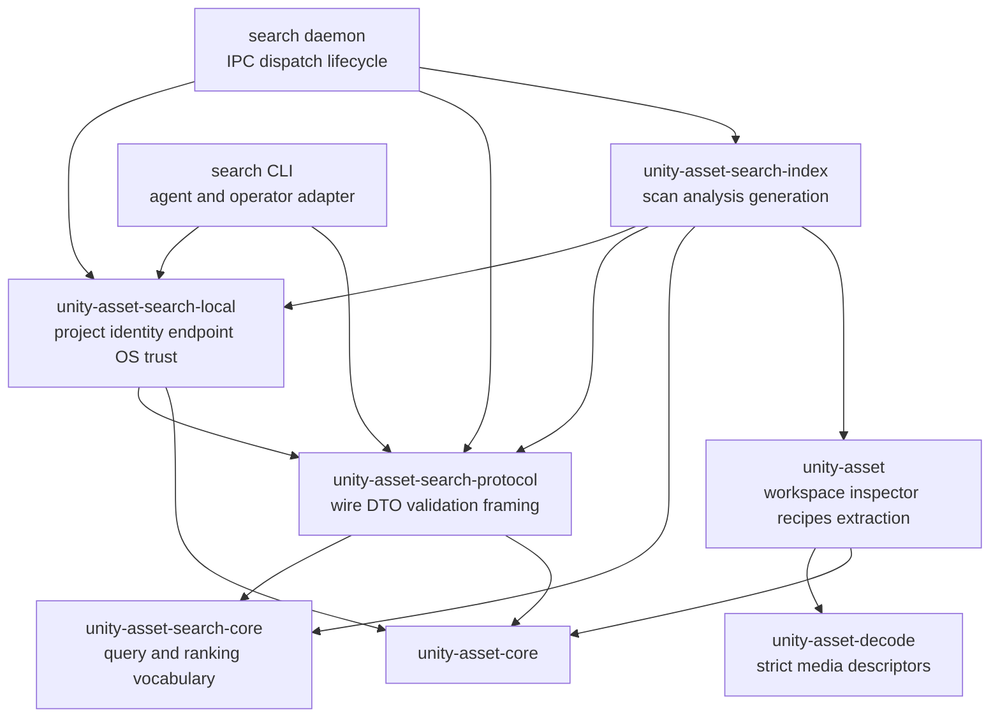
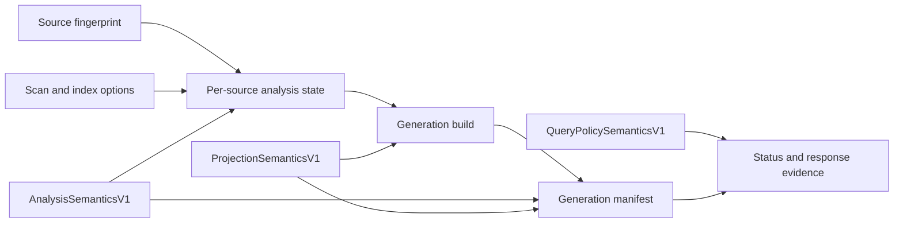
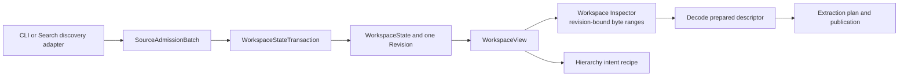
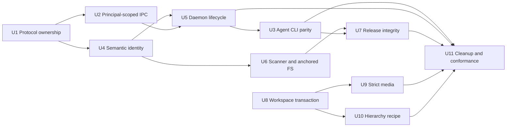

# Agent-Safe Search And Workspace Hardening - Plan

> **Transport supersession (2026-08-15):** [ADR 0005](../adr/0005-local-search-http-capability.md)
> replaces this plan's principal-scoped IPC, Bootstrap V2 session, framed-stream, native C#
> transport-adapter, and per-message OS-principal requirements. Do not implement or restore those
> parts of R1, R21-R22, KTD2-KTD3, KTD17, U2, or U11. The remaining search-domain, lifecycle,
> generation, workspace, media, release, and verification requirements continue to apply where they
> do not depend on the superseded transport.

## Goal Capsule

| Field | Contract |
|---|---|
| Objective | Turn the current Unity asset workspace and local search stack into a publishable, execution-principal-scoped, semantics-versioned product surface that Rust callers, CLIs, Unity integrations, and AI agents can use through the same strict contracts. |
| Authority | This plan supersedes ADR 0001's loopback HTTP and bearer-token transport decisions. ADR 0004's workspace, publication, and derived-view boundaries remain authoritative. The completed TypeTree, Prepared Artifact, single-writer immutable Search Generation publication, and publication-protocol invariants from the 2026-07-15 plan are not reopened; this plan intentionally extends Search Generation semantic identity, manifest/storage contracts, and lifecycle evidence. |
| Execution profile | Breaking replacement with same-unit deletion when each replacement lands, one owner for each invariant, sequential focused Cargo gates, platform-specific CI for Unix behavior, and reviewable conventional commits by implementation unit. |
| Stop conditions | Stop only for an operating-system guarantee that invalidates the execution-principal-scoped IPC design, an independently verified wire-format contradiction, or a required change in product scope. Compatibility with the deleted HTTP, token, gitignore, or shallow facade surfaces is not a stop condition. |
| Tail ownership | ce-work owns implementation, focused verification, simplification, Codex-only review, commits, and final workspace gates under the active goal. |

---

## Product Contract

### Summary

Ship a trustworthy local Unity asset intelligence layer. A project owner can index Unity assets once, query names, objects, hierarchy, script symbols, and references through a typed local protocol, and use the same structured surface from a terminal, Unity integration, or AI agent. A caller can also perform workspace source admission, strict media extraction, and hierarchy mutations without reconstructing internal state or accepting a capability that will later fail deterministically.

### Problem Frame

The deep modules created by the previous plan are mostly in place, but the product boundary still has release and correctness gaps. Published search-index consumers silently lose the workspace-only globset patch. The daemon exposes project data to every local account over unauthenticated loopback HTTP, while mutating calls send a long-lived bearer token through a proxy-aware HTTP client. The nominal protocol crate depends upward on Tantivy-backed search-index types, so it is not a lightweight contract for agents or Unity clients.

The index persists source state without identifying the analyzer and projection semantics that produced it. A code upgrade can therefore reuse stale analysis as if it were current. Daemon startup, watcher failure, staging cleanup, and health are reported by unrelated mechanisms. Workspace state changes still coordinate SourceCatalog and SourceStore manually in more than one place. Media converters accept truncated non-empty inputs because metadata probes swallow read failures, and extraction stores a free-form extension rather than a prepared format proof. Hierarchy callers must construct a parallel state graph even though the recipe owns the actual parent-child invariants.

The intended result is not a generic agent command bus or a remote asset server. It is a finite, versioned local product contract over deep Rust modules, with deterministic JSON, explicit budgets, strict state transitions, and the same capabilities for humans and automation.

### Actors

- A1. Rust library caller - embeds workspace, inspection, mutation, extraction, and search capabilities.
- A2. Local operator - starts one daemon for a Unity project and expects honest status, recovery, and shutdown behavior.
- A3. Automation or AI agent - discovers capabilities and invokes typed operations through a CLI or local protocol without parsing display text.
- A4. Unity integration - consumes a small versioned contract and a bundled platform daemon from a separate repository.
- A5. Release maintainer - publishes crates and binaries that are reproducibly tied to one tag and work outside this workspace.

### Requirements

#### Local Protocol And Agent Surface

- R1. Replace loopback TCP, unauthenticated read routes, bearer tokens, token rotation, and proxy-aware HTTP clients with execution-principal-scoped local IPC on Unix and Windows, bound to explicit project, daemon instance, server process, and lease-owned endpoint-claim identities and verified in both directions before bootstrap data is disclosed. One private publication protocol owns fixed per-artifact staging and quarantine leaves, commit points, conditional withdrawal, and crash recovery for runtime bindings, rendezvous records, and descriptors; a replacement generation is never interpreted through stale discovery evidence. Raw local IPC streams remain transport-private. The cross-crate transport seam exposes only bounded frame operations, and every inbound frame revalidates the expected execution principal before its payload is returned.
- R2. Make `unity-asset-search-protocol` own all versioned request, response, error, capability, status, generation, cursor, and framing contracts without depending on search-index or Tantivy.
- R3. Use a finite typed operation enum, fixed-width wire values, portable UTF-8 path representations, and strict DTO validation. Reject unknown fields, contradictory terminal states, invalid limits, stale cursors, oversized frames, trailing JSON bytes within a frame, and unsupported contract versions before domain execution. A pipelined second request never enters domain dispatch and closes the connection when detected; the already validated first request may complete.
- R4. Give the search CLI complete action and context parity: daemon start/attach/instance-bound stop, bootstrap/capabilities, status, search, suggest, incoming and outgoing references, object and GUID selectors, cursors, asynchronous reindex admission/status/wait/cancel, and bounded JSON request input from a path or stdin.
- R5. Keep prepared workspace authority in-process. Search IPC may carry canonical search and filesystem-reindex intents and their reports, but cannot represent Workspace mutation, `PreparedChange`, file handles, live snapshots, naked `ChangeSet`, or opaque prepared media proofs.

#### Search Correctness And Reliability

- R6. Version and digest analysis, projection, and query semantics independently from storage and wire versions. Bind analysis and projection identities to persisted source state, generation identity, manifests, status, and rebuild decisions. Bind query-policy identity to status, query responses, and cursors; a query-policy-only change does not rebuild persisted state unless it also changes a persisted projection or schema.
- R7. Treat a semantics mismatch as a typed rebuild requirement that performs full re-analysis; never classify it as corruption or silently reuse prior analysis.
- R8. Use one deterministic private index root for a project regardless of whether `Library/` exists. Unix roots are effective-UID-private. Windows persistent roots are user-SID-private and retain the normal Windows privilege and integrity dominance model. Protected, non-inheriting logon-context DACLs provide namespace hygiene and accidental cross-session isolation, but the persistent user SID remains the filesystem authorization boundary because that SID owns the objects and can change their DACLs from another logon. Exact `SecurityContextIdV1` equality remains the IPC authorization boundary. An explicit override that cannot prove the applicable user owner, DACL/mode, and no-follow invariants is rejected.
- R9. Expose daemon lifecycle, initial reconcile, watcher supervision, active/building generation, semantic compatibility, staleness, and last failure through one state model that distinguishes liveness, query availability, and readiness.
- R10. Preserve single-writer immutable Search Generations and independent periodic reconcile. A watcher is a latency optimization, not the only recovery path.
- R11. Replace the unpublished globset patch and `ignore` dependency with a caller-budgeted scanner and project-specific ignore policy whose behavior and allocation bounds are owned by this repository.
- R12. Use one fail-closed anchored filesystem implementation for scanning and persisted-state reads on Unix and Windows. Unsupported targets return a typed unsupported-platform error instead of following paths through an insecure fallback.

#### Workspace And Domain Correctness

- R13. Make one private `WorkspaceStateTransaction` the only way to coordinate SourceCatalog and SourceStore candidate changes, validation, content replacement, and installation of one Workspace Revision.
- R14. Make decode own strict media format inspection and prepared output descriptors, while Workspace Inspector remains the only owner of streamed byte-range resolution and extraction remains the only owner of paths and publication.
- R15. Make capability classification and recipe lowering share the same field-shape classifier, including AudioClip streamed-resource variants and malformed field cases.
- R16. Make hierarchy mutation accept a Workspace View plus a typed intent, derive and validate the current hierarchy internally, and delete public caller-constructed `HierarchyState` and `HierarchyNode` projections.

#### Release And Structural Quality

- R17. Declare and test an MSRV, pin release toolchains and release-critical actions, and prove every published crate and binary from an isolated packaged-consumer dependency graph before the first irreversible publish.
- R18. Use one tag-driven release path. Delete arbitrary-ref asset backfill and require source SHA, tag, crate versions, checksums, binaries, and provenance to describe the same commit.
- R19. Delete obsolete HTTP/token code, root-level patching, vendored globset, YAML re-export adapters, duplicated media parsers, stale stress helpers, and tests that only preserve removed behavior.
- R20. Split oversized implementation files only after their invariants move behind deep private modules; do not split cohesive modules or create forwarding-only files.
- R21. Publish a cross-language IPC contract package with non-empty golden fixtures, shared positive and negative Bootstrap V2 fixtures, and a C# codec/reference adapter so the separate Unity plugin can perform a coordinated breaking migration without an HTTP compatibility window.
- R22. Bound transport resources across connections, not only per frame: ordinary and control-reserved session capacity, in-flight operations, header/body/idle/write deadlines, response materialization, and long-operation retention all have explicit limits and structured saturation behavior. Exhausting persistent ordinary sessions must not starve bounded status or shutdown access.

### Key Flows

- F1. Local query
  - **Trigger:** A CLI, Unity integration, or agent requests search, suggest, references, or status for a project.
  - **Steps:** Resolve the project and atomically published endpoint descriptor; establish IPC; mutually verify the execution principal and server process; complete bootstrap for the expected project and daemon instance; read one bounded request frame; validate the typed operation. Status reads lifecycle evidence directly; search, suggest, and references pin one active generation when serving is available or return structured not-ready evidence. Return one bounded response frame.
  - **Outcome:** Project data never crosses an unauthenticated TCP boundary, and every client receives the same strict contract.
- F2. Reindex and readiness
  - **Trigger:** Startup, filesystem change, explicit reindex, missed watcher event, or semantic version mismatch.
  - **Steps:** Give every admission a server operation ID. Client admissions additionally carry a transport request ID and optional idempotency key; internal admissions record an explicit startup, watcher, timer, or semantic-upgrade source. Coalesce the intent; expose queued/running/terminal state for bounded retention; analyze affected sources; publish one immutable generation; periodic reconcile repairs missed work.
  - **Outcome:** Callers can distinguish alive, queryable-stale, rebuilding, ready, and degraded states without guessing from process existence.
- F3. Agent structured invocation
  - **Trigger:** An agent has convenience arguments or a JSON request artifact.
  - **Steps:** CLI lowers input to one protocol request; validates it locally; invokes IPC; validates the response; emits exactly one JSON result or one structured JSON error.
  - **Outcome:** Agent and human CLI flows have action parity, cursor continuity, stable exit behavior, and no display-text parsing.
- F4. Semantic upgrade
  - **Trigger:** A new binary opens an index written with older analysis or projection semantics.
  - **Steps:** Compare semantic identities; retain the old complete generation as queryable stale data when valid; schedule full re-analysis; publish a compatible generation; switch readiness to current.
  - **Outcome:** No mixed or falsely fresh generation appears, and corruption remains distinguishable from planned rebuild.
- F5. Workspace source transaction
  - **Trigger:** Discovery admits a source batch, search refresh replaces sources, or commit/recovery advances verified content.
  - **Steps:** Build one state transaction; apply all catalog and store operations; validate joint invariants and budget; atomically install one state and one revision.
  - **Outcome:** Partial candidate state is never observable and one logical batch produces one revision.
- F6. Strict media extraction
  - **Trigger:** A caller extracts an AudioClip or Texture through a Workspace View.
  - **Steps:** Inspector resolves one revision-bound byte range; decode strictly parses the entire required layout; decode returns a typed descriptor and writer; extraction verifies the planned descriptor and suffix before creating staging output.
  - **Outcome:** Truncated or contradictory media fails before publication, and metadata, content, MIME, extension, and output bytes agree.
- F7. Hierarchy mutation
  - **Trigger:** A caller requests reparenting or insertion through a typed hierarchy intent.
  - **Steps:** Recipe inspects the Workspace View; derives parent and child facts; validates bidirectional links, cycles, source and revision; lowers one ordered Mutation Plan.
  - **Outcome:** The caller cannot submit a parallel hierarchy projection that contradicts object data.
- F8. Reproducible release
  - **Trigger:** A signed release tag is pushed.
  - **Steps:** Validate tag/version/MSRV; package every crate; verify isolated consumers; build platform binaries from the tag commit; attest and checksum artifacts; publish crates in dependency order; attach the exact binaries.
  - **Outcome:** A release consumer obtains the behavior tested at the tag, including the bounded scanner, without workspace-local patches.

### Command Ownership Matrix

| Capability | Protocol | Search daemon | Search CLI / agent | unity-asset CLI / Rust | Unity integration |
|---|---|---|---|---|---|
| Hello, capabilities, lifecycle status | Owns wire | Executes | Full parity | Not applicable | Consumes |
| Search and suggest | Owns wire | Executes | Full parity | Optional library use | Consumes |
| Incoming/outgoing references and cursors | Owns wire | Executes derived index query | Full parity | Owns authoritative Workspace View queries separately | Consumes |
| Filesystem reindex admission/status/wait/cancel | Owns wire | Executes and coalesces | Full parity | May trigger through search client | Consumes |
| Workspace inspect/prepare/preview/commit/recover | Cannot represent | Cannot execute | Cannot invoke through daemon | Sole authority | Uses a separate local structured workflow |
| PreparedChange, live Workspace View, naked ChangeSet | Cannot represent | Cannot accept | Cannot serialize | Process-local only | Cannot receive |

### Acceptance Examples

- AE1. Given a different Unix effective UID or a Windows peer with a different user SID, logon SID, integrity level, elevation type, restricted-token state, or AppContainer identity, either endpoint rejects the peer before bootstrap or business data is returned. The endpoint descriptor is non-secret rendezvous metadata and contains no asset, path, query, result, or mutation content.
- AE2. Given a malicious process that occupies the expected endpoint, a process crash during binding/descriptor publication, or a daemon replacement between discovery reads, the lease-owned endpoint claim either recovers a complete generation or fails closed. The client rejects the server process identity before sending bootstrap project or instance data and classifies a verified generation change as retryable `EndpointChanged`; neither side falls back to TCP or an alternate endpoint.
- AE3. Given a declared frame length above the request limit, the daemon closes the connection with a bounded protocol error and allocates no declared-length buffer.
- AE4. Given unknown JSON fields, trailing JSON bytes, an oversized frame, or an unsupported version, execution does not reach SearchIndex. Given a second request before the first response, the first validated request may complete, but the second never reaches SearchIndex and the connection closes when pipelining is detected.
- AE5. Given a reindex response with only one terminal field, a still-building terminal status, or mismatched generation IDs, protocol validation rejects it and the CLI exits nonzero.
- AE6. Given search limit zero, the result is empty by contract; given a value over the maximum, every adapter returns the same structured invalid-request error rather than clamping.
- AE7. Given a CLI references request using an outgoing ObjectAddress and a cursor, the second page binds to the same generation, query-policy identity, direction, and selector without a human-only flag path; a policy mismatch returns a typed stale-cursor error.
- AE8. Given an index produced by prior analysis semantics, opening it reports queryable-stale when a valid generation exists, schedules a full rebuild, and never reuses cached per-source analysis as current.
- AE9. Given no `Library/` directory on first run and one on the next run, both processes derive the same private per-user index root from the stable project identity. A project rename on the same filesystem preserves that identity, a copy receives a new identity, and an insecure override is rejected.
- AE10. Given watcher initialization or runtime failure, status reports the failure, a supervised retry occurs with bounded backoff, and periodic reconcile still converges the index.
- AE11. Given a failed generation build whose immediate staging cleanup fails, the error remains observable and startup or periodic cleanup removes the abandoned staging tree safely.
- AE12. Given maximum allowed ignore patterns containing required extensions, packaged search-index uses one bounded project matcher and has no `ignore`, workspace patch, or vendored globset dependency.
- AE13. Given a symlink or reparse point in a scanned path, both scanning and persisted-state reads reject it through the same anchored filesystem module; unsupported platforms refuse the operation.
- AE14. Given a batch whose last source conflicts or exhausts budget, catalog, store, workspace revision, and reference cache all remain at the original state.
- AE15. Given malformed AudioClip offset/size fields, capability inspection rejects the recipe with the same reason that lowering would return.
- AE16. Given truncated WAV, Ogg, FSB5, texture, or streamed bytes, strict preparation returns a typed layout error and no extraction staging file is created.
- AE17. Given a caller attempts to construct stale or contradictory hierarchy nodes, the public type no longer exists; the Workspace View based recipe either derives a valid plan or returns structured mismatch/cycle diagnostics.
- AE18. Given a crates.io-style isolated consumer, every published crate resolves without repository patches and all release binaries report the same version and source commit as the release tag.
- AE19. Given a descriptor for another project or a stale daemon instance, bootstrap and every business request reject the project/instance mismatch before query execution.
- AE20. Given a reindex connection that drops after admission, the caller can retry the same idempotency key and normalized intent, recover the same operation ID, and query queued, coalesced, running, succeeded, failed, expired, or lost status without duplicating the rebuild. Reusing that key for a different normalized intent returns a non-retryable structured idempotency conflict and admits no work.
- AE21. Given slow, partial, idle, or non-reading clients across the configured connection limit, the daemon enforces deadlines and global backpressure while a bounded control-reserved lane keeps status and shutdown reachable and already admitted reindex operations observable.
- AE22. Given the published Rust/C# fixtures, a matching Unity adapter exchanges every non-empty operation and rejects unsupported Bootstrap V2/business revisions, malformed policy identities, and mismatched project or daemon instance identities without falling back to HTTP.

### Success Criteria

- No production dependency on axum, reqwest, tower-http, bearer tokens, token files, or loopback TCP remains in the search daemon and client path.
- `unity-asset-search-protocol` has no dependency on search-index or Tantivy; the CLI has no direct dependency on search-index.
- Every public wire DTO is strict, versioned, semantically validated, and covered by invalid-state tests.
- Wire DTOs contain no platform-width integers, `u128`, native `PathBuf`, or implementation-only types.
- Analysis and projection implementation changes have one explicit identity bump point and force a typed full rebuild.
- A default project has exactly one deterministic platform-private index location and one execution-principal-scoped local endpoint.
- Search scanning is publishable, caller-budgeted, no-follow on supported platforms, and independent of the vendored globset patch.
- Workspace source admission and baseline replacement install state through one private transaction.
- Audio/texture inspection is strict and shared by capability, planning, and extraction execution.
- Hierarchy callers express intent, not a reconstructed graph.
- Isolated package, Windows, Linux, and macOS gates pass before release.

### Scope Boundaries

#### In Scope

- All P1 and P2 findings from the July 2026 architecture, API, persistence, reliability, and security audits.
- Breaking Rust, CLI, persisted-index, and local protocol changes needed to remove unsafe or shallow surfaces.
- A replacement ADR for local search transport and updates to the Unity plugin integration contract.
- Deletion of VCS ignore compatibility in favor of one documented project-specific ignore policy.
- Windows implementation locally; Unix-specific behavioral gates in CI as requested.

#### Deferred To Follow-Up Work

- Updating and releasing the separate Unity Editor plugin repository. This repository does publish the C# reference codec, schemas, compatibility matrix, and fixtures needed by that external change.
- Remote multi-user search, TLS, web dashboards, and network service discovery.
- Long-lived multiplexed IPC, streaming result pages, subscriptions, or unsolicited daemon events.
- General lossless Unity YAML syntax preservation beyond current workspace requirements.
- New media families whose decoders do not yet exist.
- A content-addressed private mapped Asset Source backing, including resident-memory baselines,
  quota, crash GC, and Windows mapping lifetime. U8 must leave an opaque immutable backing seam
  but does not implement this storage adapter.
- Mesh-to-GLB and other new extraction representations. They require a versioned Unity corpus,
  bounded dependency closure, coordinate-conversion evidence, and GLB reopen/digest gates.
- ZIP/APK ancestor rebuild, including an explicit fidelity contract for compression method,
  metadata, duplicate names, ZIP64, determinism, and APK signature invalidation.
- Planner-owned complete Reference Graph acquisition and deletion of caller graph injection.
- First-class Asset, Object, Script Symbol, and Container Search Entities, including the required
  business-protocol revision and corpus-based entity/index/query limits.
- Deeper traversal over the existing persisted reference projection. A second adjacency artifact
  is allowed only if corpus benchmarks prove that the current projection cannot meet the target.
- A fact-composed Capability Catalog after R14/R15 and representation/entity ownership stabilize,
  and native TypeTree acquisition only after a managed/IL2CPP corpus gate succeeds.

#### Outside This Product's Identity

- An LLM runtime, prompt engine, MCP server, or natural-language parser inside core crates.
- A generic string command bus or arbitrary code execution endpoint.
- Compatibility aliases for deleted HTTP endpoints, bearer tokens, `.gitignore` behavior, `HierarchyState`, or forwarding-only adapters.
- Claiming cross-file atomic visibility beyond ADR 0004's recoverable per-artifact publication contract.

---

## Planning Contract

### Assumptions

- The user explicitly authorizes breaking changes, deletion, and fearless refactoring; compatibility shims are unnecessary.
- The IPC trust boundary is the effective UID on Unix and a matching `SecurityContextIdV1` on Windows. The Windows identity includes user SID, logon SID, integrity level, elevation type, restricted-token state, and AppContainer identity; same-user processes with different effective security contexts are not equivalent IPC peers. Persistent Windows filesystem storage is protected from other user SIDs, while processes running as the same persistent user SID, including another logon, are inside the storage boundary. Logon-context DACLs are defense in depth rather than a provenance proof because Windows owner authority follows the persistent user SID. The normal Windows privilege and integrity dominance rules still apply.
- Windows, Linux, and macOS are supported runtime targets. Other targets may compile, but filesystem scan and daemon transport must return typed unsupported-platform errors.
- The CLI is the primary automation and AI-agent surface in this repository. The separate Unity plugin consumes the same wire fixtures after its own migration.
- CLI and daemon commands take an explicit project root; the CLI may use the current directory only when it is itself a valid Unity project root and never probes parents. Unity integration passes its project root explicitly.
- The in-repository C# reference package targets `netstandard2.0`, uses no Unity APIs, and exposes one transport-neutral `Stream` adapter boundary. Platform endpoint discovery, IPC, peer identity, process lifecycle, and concrete Unity Editor support remain owned and qualified by the external plugin repository.
- The search daemon remains a derived-read-model service. Workspace mutation and publication continue through `unity-asset` Rust APIs and `unity-asset-cli`, never through search IPC.
- IPC v1 uses a persistent connection with one in-flight request at a time. It does not multiplex, compress, or push unsolicited events; clients use a small bounded connection pool only when parallel callers require it.
- A valid stale Search Generation may remain queryable during rebuild, but readiness is false until current semantics and desired revision are active.
- Root `.gitignore` and `.ignore` semantics are not part of Unity asset identity. `.unity-asset-search-ignore` becomes the sole explicit user policy file.
- `repo-ref/UnityPy` and `repo-ref/assetripper` remain behavioral references, not runtime or release dependencies.

### Key Technical Decisions

- KTD1. **Break instead of layer.** `session-settled: user-directed`. Delete compatibility paths when their replacement lands. The rejected alternative is keeping HTTP, tokens, gitignore, and old public recipe state behind deprecated wrappers, which would preserve the same security and ownership defects.
- KTD2. Replace local HTTP with execution-principal-scoped IPC plus one lease-bound `EndpointClaim` that owns server preparation, crash-atomic binding/rendezvous/descriptor publication, stale recovery, conditional cleanup, and replacement generation checks. A crate-private publication module provides the only prepare, atomic replace, post-commit verification, conditional quarantine withdrawal, and recovery operations. Each artifact has deterministic current, staging, and quarantine names: recovery may remove staging or quarantine only after its authority is held, while an unexpected live staging name fails closed rather than being silently overwritten. Unix uses a short hashed socket name and claims or unlinks a verified leaf only while holding the project lease; client and server both validate endpoint ownership and peer effective UID. Windows publishes one random, single-use, first-instance pipe slot at a time through a crash-atomic volatile rendezvous, creates each pipe directly with the final protected client DACL, rejects remote clients, and rotates before returning an accepted connection; a Tokio/Mio pipe object is never recycled across sessions. Stable product/runtime/cache parents are scoped to the user SID with only create-child/traverse rights, while security-context children use protected non-inheriting logon-context DACLs as defense in depth inside the user-SID filesystem boundary. No client-visible handle receives pipe-instance creation or ACL/owner mutation rights. Endpoint acceptance and connection feed a `VerifiedFramedTransportV1` that does not implement public `AsyncRead` or `AsyncWrite`; its bounded inbound-frame operation performs the message-principal check before exposing bytes. Daemon and CLI session owners layer Bootstrap V2 and typed business binding over that transport, so routing cannot omit peer or per-message verification. Both sides compare `SecurityContextIdV1`, and before Bootstrap V2 the client binds the OS-reported peer PID to a stable process-start identity from one verified process snapshot. A descriptor-self-declared executable file identity is intentionally excluded: it adds no authorization inside a same-principal namespace and is unstable when Windows or macOS atomically replaces the executable path. Project and instance IDs bind every business request; no automatic fallback transport exists.
- KTD3. Use bounded framed JSON, not HTTP-over-IPC. A four-byte big-endian length prefixes each canonical JSON request or response; length is checked before allocation. After bootstrap, a persistent connection carries sequential exchanges with at most one in-flight request and closes after any framing error. Pipelining may be detected only after the first request was dispatched, so the first validated request may finish while the second is never dispatched. Envelopes use fixed-width integers and contain request, project, and instance IDs. The daemon enforces frame/JSON limits, deadlines, connection and in-flight semaphores, bounded response construction, and structured busy/retry evidence.
- KTD4. Make the protocol crate the dependency floor. It may depend on `unity-asset-core` and the pure `unity-asset-search-core` vocabulary, but never on search-index. Search-index either returns protocol DTOs through a downward dependency or maps internal results at its public boundary. The daemon owns operation dispatch.
- KTD5. Expose a closed typed operation enum, not a string command bus. Each variant has its own request type, resource model, and validation; responses use an explicit typed result envelope and a shared structured error. The enum includes an instance-bound graceful shutdown operation but cannot express Workspace mutation, PreparedChange, or naked ChangeSet. Adding an operation is a contract version decision.
- KTD6. Give agents parity through the ordinary CLI. Convenience flags and `--request-json` lower into the same operation enum, receive the same generation and capability context, and emit one machine-readable result. There is no agent-only mutation or hidden workflow endpoint.
- KTD7. Separate semantic identities by reason. Analyzer, search projection, and reference projection identities enter their cache keys, manifest, and logical generation content identity; query-policy identity is exposed in status and response evidence and binds every cursor or query binding. Storage and wire contract versions remain independent. Any stored semantic mismatch forces full re-analysis rather than selective optimistic reuse. Parent generation, event order, and applied transaction provenance remain activation evidence and do not perturb the logical content ID.
- KTD8. Model daemon state as orthogonal evidence, not one boolean. Lifecycle, serving availability, generation freshness, reconcile, generation-staging maintenance, watcher, and periodic timer status are explicit. A successful publication may independently report `recovery_required` with bounded cleanup evidence until periodic reconcile removes abandoned staging; this is never rewritten as a generation build failure. A valid stale generation remains queryable with actual/desired evidence; no active generation returns retryable not-ready. Watcher failure degrades observability and latency but periodic reconcile remains independent.
- KTD9. Replace `ignore` with a repository-owned `SearchIgnoreV1` matcher and a deterministic scanner. The matcher supports a deliberately documented bounded subset compiled into one shared multi-pattern automaton, preserves ordered exclude/re-include behavior, and rejects unsupported syntax. The rejected alternatives are an unpublished root patch, a privately published fork chain, or pretending per-rule regex state is caller-budgeted.
- KTD10. Treat directory discovery as untrusted input and file handles as authority. The scanner uses a no-follow traversal policy and reopens every consumed file through one anchored root. Unix and Windows implementations share the same public failure semantics; the generic platform implementation refuses sensitive operations.
- KTD11. Put SourceCatalog and SourceStore behind one in-process, non-serializable state transaction. It owns the expected state Arc, candidate cloning, register/remove/replace operations, joint validation, and preparation of a candidate state. AssetWorkspace installs it with pointer CAS only after any durable publication succeeds; a no-op retains the revision and a stale expected state returns a typed conflict. SourceAdmissionBatch remains the discovery value and does not become another transaction engine.
- KTD12. Use strict prepared media descriptors. After applying an explicit, corpus-proven Unity-version precedence rule, a shared fallible classifier must produce exactly one valid non-empty effective embedded or streamed payload and records the rule as evidence. A dual payload without an applicable rule is `AmbiguousPayload`; other outcomes distinguish NotApplicable, TypeTreeUnavailable, and InvalidDescriptor. Only TypeTreeUnavailable may enter an explicitly versioned raw parser; malformed TypeTree evidence never falls back heuristically. Decode owns format/container/layout inspection and returns a closed descriptor plus an in-process prepared writer. Extraction serializes only the expected descriptor and re-prepares at execution; it never serializes opaque proof or resolves stream paths independently of Workspace Inspector.
- KTD13. Move hierarchy derivation behind the recipe. A public typed intent names child, target parent, and placement. The recipe queries a revision-bound Workspace View, derives only the reachable facts needed for validation, detects cycles and bidirectional mismatches, and lowers generic mutations.
- KTD14. Make release verification precede publication. A release can only start from the peeled signed-tag commit and every release Cargo invocation uses the locked dependency graph. A cross-platform verifier first creates and unpacks every internal `.crate` archive in dependency order without verification, rejects any packaged manifest that retains a path dependency or depends on a root-only patch, then builds temporary consumers in an isolated Cargo home whose consumer-level `[patch.crates-io]` points only to those unpacked internal archives while third-party dependencies resolve from the registry. It builds documented feature combinations and release binaries, then records tag/commit/version/lockfile/toolchain evidence before `cargo publish`. Artifact attestations supplement checksums; they do not repair a non-reproducible source selection.
- KTD15. Split files around established ownership only. Protocol, transport, lifecycle, state transaction, media descriptor, and anchored filesystem modules are real seams. `source_catalog.rs`, format parsers, and publication persistence stay cohesive unless implementation reveals a second independent responsibility.
- KTD16. Make reindex a connection-independent, process-lifetime observable operation owned by the daemon lifecycle rather than the IPC dispatcher. Every startup, watcher, timer, semantic-upgrade, and client admission receives an operation ID. A prepared normalized intent has a domain-separated fixed-width fingerprint; the registry binds an optional client idempotency key to both operation ID and fingerprint, returns the existing ID only for the same intent, and reports a structured non-retryable conflict otherwise. Status/wait/cancel are separate typed operations and connection loss never cancels admitted work. Cancellation succeeds only for queued, unmerged work owned exclusively by that operation and never interrupts publication. Terminal records are retained by explicit count and time limits, and restart reports unmatched prior IDs as lost while generation/reconcile state remains authoritative.
- KTD17. Perform a coordinated protocol break for Unity. Publish JSON schema, non-empty golden request/response fixtures, and a `netstandard2.0` C# bootstrap/framing/DTO reference package with no Unity API dependency. The reference package stops at a transport-neutral `Stream` interface; source-level native adapters in the external plugin own Unix peer credentials and any managed-profile transport gaps. Matching plugin and daemon versions are bundled together; incompatible peers fail during bootstrap and never fall back to the deleted HTTP path. The external plugin repository alone claims and tests concrete Unity Editor versions.
- KTD18. Define project location and identity before transport discovery. `ProjectLocatorV1` accepts an explicit existing project root, opens it without following a root link, validates ordinary `Assets` and `ProjectSettings` directories, and derives domain-separated `ProjectIdentityV1` from the platform's stable directory file identity. A rename on the same filesystem preserves identity, a copy or cross-filesystem move receives a new identity, and targets without stable local file identity are unsupported for daemon mode. Linux uses a validated private XDG runtime/cache root with a short `/tmp` fallback, macOS uses a validated private per-user temporary root and `~/Library/Caches`, and Windows uses protected `%LOCALAPPDATA%` runtime/cache roots. Endpoint descriptors and default index roots are keyed by this identity.
- KTD19. Freeze `BootstrapHelloV2` independently from business revisions. It uses the same bounded four-byte big-endian frame, a small fixed schema and size cap, strict project/instance binding, a non-zero query-policy identity, and a bounded sorted unique list of supported business revisions. The server selects exactly one highest common revision or returns a bootstrap-level incompatibility error; only then may either side parse a versioned business envelope. Rust and C# share positive and negative bootstrap golden fixtures.

### High-Level Technical Design

#### Compile-Time Ownership



#### Local IPC Request Sequence

```mermaid
sequenceDiagram
  participant C as CLI or Unity client
  participant E as Endpoint descriptor
  participant T as Principal-scoped transport
  participant D as Daemon dispatcher
  participant I as SearchIndex

  C->>E: read project, instance, process, and security binding
  C->>T: connect
  T->>T: mutually verify OS identity before payload
  C->>D: BootstrapHelloV2(project, instance, policy, revisions)
  D-->>C: selected revision and exact binding
  C->>D: next bounded frame(RequestEnvelope with binding)
  D->>D: validate version, variant, limits, invariants
  D->>I: execute typed domain request
  I-->>D: result plus generation evidence
  D-->>C: bounded frame(ResponseEnvelope)
  Note over C,D: Sequential exchanges; one in-flight request
  C->>C: validate response and emit one JSON value
```

#### Daemon Lifecycle

```mermaid
flowchart TB
  Events[Startup, filesystem, semantic, and shutdown events]
  Lifecycle[Lifecycle: booting | serving | draining | stopped]
  Serving[Serving: unavailable | queryable]
  Freshness[Freshness: absent | unverified | stale | current | unmanaged]
  Reconcile[Reconcile: idle | queued | running | failed]
  Watcher[Watcher: disabled | starting | healthy | failed | retrying]
  Timer[Periodic timer: disabled | scheduled | running | failed]
  Evidence[One lifecycle snapshot]

  Events --> Lifecycle
  Events --> Serving
  Events --> Freshness
  Events --> Reconcile
  Events --> Watcher
  Events --> Timer
  Lifecycle --> Evidence
  Serving --> Evidence
  Freshness --> Evidence
  Reconcile --> Evidence
  Watcher --> Evidence
  Timer --> Evidence
```

#### Semantic Identity And Generation Flow



#### Workspace And Media Ownership



### Phased Delivery

1. **Contract and identity:** U1.
2. **Transport and persisted search truth:** U2, U4.
3. **Runtime lifecycle and agent surface:** U5, U3.
4. **Scanner and release eligibility:** U6, then U7's no-publish package, external-consumer, and source-identity barrier. A tag may not enter artifact or crate publication until that barrier passes.
5. **Workspace and domain depth:** U8, U9, U10.
6. **Deletion, module boundaries, and conformance:** U11, then U7's tag-driven distribution gate. U7 makes the release path valid, but this plan publishes nothing until U11 and the final Definition of Done pass.

### Implementation Dependency Graph



### Alternative Approaches Considered

- Authenticate every HTTP route and disable proxies. Rejected because it retains bearer lifecycle, rogue listener identity, Windows token-root ACL, proxy configuration, and separate HTTP semantics for a local-only service.
- Serve HTTP over UDS and named pipes. Rejected because HTTP parsing and connector dependencies add no value to a one-client local typed protocol and complicate Windows clients.
- Publish local forks of both `ignore` and `globset`. Rejected because it creates a permanent third-party fork release chain for a scanner whose Unity-specific policy can be smaller and budgeted.
- Keep `.gitignore` compatibility with a low rule cap. Rejected because the upstream per-rule regex cache bound remains too large to charge honestly and VCS inclusion is not asset identity.
- Store one global `INDEX_VERSION`. Rejected because it conflates wire, storage, analysis, projection, and query changes and causes unnecessary rebuilds or missed rebuilds.
- Serialize prepared media proof through IPC. Rejected because live byte identity and prepared writer authority are process-local and must be recreated against the current Workspace View.
- Add a generic Workspace transaction trait. Rejected because there is one implementation and one owner; a private concrete deep module carries the invariant without an artificial seam.
- Bridge interactive Unity queries through one CLI subprocess per request. Rejected because process startup and a second stdin/stdout contract do not meet Editor typeahead latency or connection reuse needs; a persistent proxy would recreate transport lifecycle and backpressure above the same daemon. The C# package remains a narrow protocol reference while the external plugin owns Editor lifecycle.
- Replace reindex operations with only desired-generation polling. Rejected because a dropped admission response cannot distinguish accepted, coalesced, cancelled, or duplicated work. Process-lifetime operation IDs provide retry idempotency while generation and reconcile state remain the durable authority.

### Deletion Ownership

| Removed surface | Owning replacement | Unit |
|---|---|---|
| axum routes, HTTP endpoint constants, reqwest client, token store and rotation | Typed framed local IPC | U1-U3, U5 |
| search-index response DTO ownership and re-export layer | search-protocol contracts | U1 |
| workspace-only globset patch, vendored globset, `ignore` traversal | ProjectScanner and SearchIgnoreV1 | U6 |
| arbitrary-ref dist upload workflow | Single tag-driven release workflow | U7 |
| manual SourceCatalog/SourceStore candidate choreography | WorkspaceStateTransaction | U8 |
| forwarding-only workspace YAML adapter | Direct YAML adapter dependency at real call sites | U8 |
| permissive media metadata probes and free-form audio extension | Strict prepared media descriptors | U9 |
| public HierarchyNode and HierarchyState | Workspace View based HierarchyIntent | U10 |
| duplicated daemon shell helpers and tests for deleted HTTP/token behavior | IPC black-box harness | U11 |

---

## Implementation Units

### Unit Index

| Unit | Goal | Depends On | Primary Requirements |
|---|---|---|---|
| U1 | Invert and harden protocol ownership | None | R2, R3, R21 |
| U2 | Replace HTTP and tokens with principal-scoped IPC | U1 | R1, R3, R5, R21, R22 |
| U3 | Complete the agent-native CLI contract | U5 | R4, R5 |
| U4 | Bind index persistence to semantic identity | U1 | R6-R8 |
| U5 | Centralize daemon lifecycle and recovery | U2, U4 | R9, R10 |
| U6 | Own bounded scan, ignore, and anchored reads | U4 | R11, R12 |
| U7 | Make packaging and release reproducible | U3, U6 | R17-R19 |
| U8 | Centralize workspace state transactions | None | R13, R19 |
| U9 | Enforce strict media preparation | U8 | R14, R15 |
| U10 | Move hierarchy derivation behind the recipe | U8 | R16 |
| U11 | Delete leftovers, split deep modules, and prove conformance | U3, U5, U7, U9, U10 | R19, R20 |

### U1. Invert And Harden Protocol Ownership

**Goal:** Make the protocol crate a small, strict dependency floor and eliminate response-contract drift between library, daemon, and CLI.

**Files:**

- Modify `Cargo.toml`.
- Create `crates/unity-asset-search-local/` with private project identity, runtime-root, endpoint descriptor, and platform security-context modules shared by search-index, daemon, and CLI.
- Modify `crates/unity-asset-search-protocol/Cargo.toml`.
- Replace `crates/unity-asset-search-protocol/src/lib.rs` with private `model`, `operation`, `validation`, and `framing` modules.
- Modify `crates/unity-asset-search-index/Cargo.toml` and `crates/unity-asset-search-index/src/lib.rs`.
- Delete `crates/unity-asset-search-index/src/contract.rs` after callers migrate.
- Modify generation/status modules under `crates/unity-asset-search-index/src/` only where wire ownership moves.
- Expand `crates/unity-asset-search-protocol/tests/` contract and golden fixtures.
- Create a language-neutral `integration/search-protocol/` fixture directory and a `netstandard2.0` C# reference codec project.

**Approach:**

- Implement `ProjectLocatorV1` and `ProjectIdentityV1` first, including explicit project-root validation, stable platform file identity, private platform runtime/cache roots, and `EndpointDescriptorV1` validation. Keep OS discovery and ACL dependencies out of the protocol crate.
- Freeze `BootstrapHelloV2` framing and the reference compatibility matrix before defining business envelopes.
- Move wire-visible search, suggest, reference, status, capability, generation stamp, admission, completion, and error DTOs into protocol.
- Keep pure ranking evidence types in search-core and stable asset identity/diagnostic types in core; protocol may depend downward on those crates.
- Define fixed-width `ProjectId`, `DaemonInstanceId`, `RequestId`, `OperationId`, and portable path wire values. Remove `usize`, `u128`, and `PathBuf` from every DTO.
- Define a versioned `RequestEnvelope` with query, reindex lifecycle, and graceful shutdown variants plus a matching `ResponseEnvelope` whose result variant must correspond to the request operation. Bootstrap remains a separate frozen envelope.
- Add `deny_unknown_fields` to all fixed-shape top-level and nested DTOs. Retain defaults only where an explicit backwards-compatibility acceptance example exists.
- Put per-operation encoded-byte, JSON-depth, member, entry, response, and result-count limits in protocol. Preserve search limit zero as an empty result and reject over-limit values everywhere.
- Validate cross-field response invariants, especially reindex completion/status pairing and generation equality.
- Introduce pure framing helpers that validate four-byte lengths and maximum encoded sizes without owning sockets.
- Bind every cursor and query binding to `QueryPolicyId`; define a stable stale-cursor error distinct from malformed JSON.
- Publish non-empty Rust/C# bootstrap, request, response, and structured-error fixtures. The reference project targets `netstandard2.0`, uses no Unity APIs, and exposes a public transport-neutral framed session over `Stream`; it contains no platform transport, endpoint discovery, peer-identity, or process-lifecycle adapter.

**Test scenarios:**

- Round-trip every non-empty request and response variant through canonical JSON and golden fixtures shared with the C# reference package.
- Project roots cover missing, empty, inaccessible, linked, renamed, copied, cross-filesystem, unstable-file-identity, and platform runtime/cache-root cases.
- Bootstrap exact-limit, no-common-revision, duplicate/unsorted revision, wrong project, and wrong instance fixtures are byte-compatible in Rust and C#.
- Reject unknown fields at each nested response shape, mismatched operation/result variants, invalid versions, invalid cursors, invalid limits, and contradictory terminal states.
- Reject every wire model that exposes a platform-width integer, `u128`, native `PathBuf`, or implementation-only domain type.
- Prove the closed operation enum cannot encode Workspace commit/recover, PreparedChange, live Workspace View, or naked ChangeSet.
- Prove search-index and CLI no longer need to import DTOs from each other.
- Test exact frame limit and one byte over without allocating the declared oversized frame.

**Verification:** Protocol nextest and strict Clippy pass; `cargo tree` for protocol contains neither search-index nor Tantivy.

### U2. Replace HTTP And Tokens With Principal-Scoped IPC

**Goal:** Establish a mutually verified local transport for one effective execution principal and delete the bearer-token security model.

**Files:**

- Modify `apps/unity-asset-search-daemon/Cargo.toml` and `apps/unity-asset-search-cli/Cargo.toml`.
- Create `apps/unity-asset-search-daemon/src/ipc/{mod.rs,dispatch.rs,unix.rs,windows.rs}`.
- Create `apps/unity-asset-search-cli/src/client/{mod.rs,unix.rs,windows.rs}`.
- Complete Rust platform transport and peer-verification adapters in `crates/unity-asset-search-local/`; keep the C# reference project transport-neutral and fixture-conformant for the external plugin adapter.
- Replace or delete `apps/unity-asset-search-daemon/src/app.rs`.
- Delete `apps/unity-asset-search-daemon/src/security.rs` after pipe/socket security utilities migrate.
- Modify `apps/unity-asset-search-daemon/src/main.rs` and the search CLI entry point.
- Replace daemon HTTP/security tests with IPC contract and cross-process tests.
- Update `docs/adr/0001-local-search-daemon.md` and `docs/adr/0003-unity-editor-plugin.md`.

**Approach:**

- Resolve `ProjectLocatorV1`, acquire the daemon lease, construct one `EndpointClaim`, and let that deep module own server preparation, stale retirement, crash-atomic `binding.v1`/rendezvous/descriptor publication, conditional cleanup, and replacement generation checks. Put the shared prepare/commit/recover/quarantine protocol in one crate-private module rather than repeating it in binding, descriptor, and rendezvous implementations. Its deterministic staging and quarantine names are recovered only under the binding or daemon authority; no random orphan name may accumulate after a crash. Do not accept a network URL or silently choose another endpoint.
- Keep raw Unix sockets, Windows pipe objects, and their `AsyncRead`/`AsyncWrite` implementations private to transport adapters. Endpoint connection and acceptance expose only `VerifiedFramedTransportV1`; it owns bounded frame I/O, deadlines, and the principal check performed after each complete inbound frame. Bootstrap and business routing never receive a raw stream and therefore cannot forget message-principal verification.
- On Unix, create an owner-only endpoint directory and socket, reject symlinked endpoint components, verify socket owner/mode, and compare peer UID with the effective UID on both client and server before sending bootstrap bytes. The lease-owned claim validates and unlinks a stale socket leaf without an unbounded synchronous liveness probe.
- On Windows, create one random single-use first-instance pipe slot with remote clients rejected and atomically publish only its fixed-width slot identifier. Create every slot directly with a protected final client DACL whose exact rights permit framed I/O but exclude `FILE_CREATE_PIPE_INSTANCE`, DACL/owner mutation, and deletion; rotate to the next slot before returning an accepted stream and never recycle a Tokio/Mio pipe object across sessions. Stable per-user parents grant only create-child/traverse rights to the user SID; per-security-context children retain exact protected logon-context DACLs. Server and client compare `SecurityContextIdV1`; before sending bootstrap bytes, the client binds the operating-system-reported server PID to a stable process-start identity and process-token snapshot and verifies unchanged publication evidence. Do not add a descriptor-self-declared executable identity.
- Run the frozen bootstrap negotiation only after OS identity succeeds. Then process sequential bounded request/response frames with one in-flight operation until clean close, idle expiry, pipelining, or protocol error.
- Give the C# reference package one public transport-neutral session owner that consumes `IProtocolTransportAdapter`, performs Bootstrap V2, retains the accepted binding, and validates each sequential request/response exchange. Native endpoint discovery and peer verification remain exclusively in the external plugin adapter.
- Bound accepted connections, in-flight query and reindex work, read-header/read-body/idle/write time, response construction, and slow-reader buffers. Reserve bounded short-lived session capacity for status and shutdown so ordinary persistent sessions cannot starve the control plane; non-control requests in that lane receive structured `Busy` and close.
- Remove axum, reqwest, tower-http, mime, URL base selection, token generation/storage/rotation, authorization headers, and all token documentation.
- Preserve single-writer daemon lease semantics independently from the removed token store.

**Test scenarios:**

- A same-principal Rust test client completes Bootstrap V2 and stub dispatch on Windows and Unix. The transport-neutral C# reference client completes the same framing/bootstrap exchange over its fixture stream; shared negative fixtures cover project/instance mismatch, unsupported or malformed revision sets, and zero/invalid query-policy identity. Full business-operation coverage belongs to U3 after U5 supplies operation lifecycle, while native C# transport qualification remains an external plugin gate.
- Oversized, truncated, malformed, idle, and incompatible-version connections terminate with bounded behavior before domain dispatch. A pipelined first request may finish, but the second is never dispatched.
- Different UID, user SID, logon SID, integrity, elevation, restricted/AppContainer IPC context, remote named-pipe access, and mismatched server process identity are rejected before bootstrap data is disclosed. Additional first-instance creation and opening any slot with ACL mutation rights are denied.
- Wrong project, wrong instance, endpoint collision, stale Unix socket, hostile pipe-slot occupation, descriptor/server replacement, symlink/reparse endpoint, permission mismatch, concurrent binding publication, daemon crash/restart, and Windows relogin have deterministic outcomes.
- Fault injection before and after every `binding.v1`, descriptor, and Windows rendezvous commit proves readers never observe partial JSON. A restart under the appropriate binding or daemon authority removes each abandoned deterministic staging/quarantine record, preserves a newer current record, and reports an unexpected live staging record as a typed failure rather than deleting it.
- Production-scale slow-client tests fill every ordinary session slot with idle, partial-frame, and non-reading clients while reserved status/shutdown sessions remain bounded and responsive.
- The three-platform matrix runs the complete `unity-asset-search-local` suite, not only library tests, and separately records the controlled cross-principal rejection evidence available on each operating system.
- No HTTP proxy environment variable changes local client routing.

**Verification:** Daemon, CLI, and search-local IPC nextest suites pass on Windows locally; the platform CI matrix names only existing test targets and runs `transport_contract` plus CLI IPC contracts on Windows, Linux, and macOS. Linux/macOS execution-principal and Windows cross-security-context scenarios are required CI gates.

### U3. Complete The Agent-Native CLI Contract

**Goal:** Make every useful local search operation discoverable and scriptable through one bounded structured CLI surface.

**Files:**

- Split `apps/unity-asset-search-cli/src/main.rs` into command, client, JSON input, and output modules.
- Reuse or adapt the bounded JSON input pattern from `apps/unity-asset-cli/src/json_io.rs`.
- Expand `apps/unity-asset-search-cli/tests/structured_errors.rs` and add black-box protocol command tests.
- Update `docs/EXAMPLES.md`, `README.md`, and protocol examples.
- Update stress/benchmark callers that invoke the daemon.

**Approach:**

- Add typed subcommands for daemon lifecycle, bootstrap/capabilities, status, search, suggest, references, reindex admission, reindex status, reindex wait, and bounded reindex cancel. Reference flags cover both directions, both selectors, and cursor input/output.
- Require `--project-root` unless the current directory itself is a validated Unity project root; never probe parent directories. Keep an explicit secure index-root override where required.
- Add `--request-json <path|->` as a complete protocol request path. Bound file/stdin bytes before parsing and reject additional positional operation arguments.
- Lower all convenience flags into protocol DTO constructors, then run the same validation used for JSON input.
- Give CLI JSON an independent contract version rather than exposing raw transport envelopes. Emit one compact success document on stdout; emit one versioned structured error on stderr for local, transport, protocol, and domain failures. Preserve the daemon error code, retryability, operation ID, and generation evidence, and use stable nonzero exit categories without display-text parsing.
- Preserve Clap's standard `--help` and `--version` behavior as successful display outcomes before project resolution or daemon discovery; only actual usage failures enter the structured-error contract.
- Treat `--start-if-needed` as one bounded replacement-aware acquisition loop. Retry typed `EndpointChanged`, a concurrent lease loser, and a predecessor releasing its claim within the caller deadline; never retry identity-integrity or unsafe-endpoint failures, and always reap child processes.
- Make capability and status output include protocol, semantic, availability, and readiness evidence needed by an agent to decide whether to query, wait, or reindex.
- Bound benchmark query files and propagate read errors instead of silently using an empty set.

**Test scenarios:**

- Every operation succeeds through both convenience flags and JSON request input with byte-equivalent semantic requests.
- Incoming/outgoing, ObjectAddress/GUID, file ID, cursor, idempotent reindex retry, operation status/wait, zero limit, and maximum limit behavior is covered.
- Oversized stdin, invalid UTF-8 paths, malformed JSON, unknown fields, daemon unavailable, and invalid response invariants produce one structured error and nonzero exit.
- `--help` and `--version` print their ordinary display output and exit zero without resolving a project or starting a daemon.
- Real daemon subprocess tests cover concurrent start winner/loser, predecessor replacement, delayed lease release, deadline expiry, child reaping, and one-shot startup failure recovery.
- A black-box agent flow discovers capabilities, starts reindex, waits for the matching generation, searches, and paginates references without parsing display text.
- Exhaustive mapping tests require every protocol operation variant to have a daemon dispatch decision and a CLI/agent mapping; intentionally unsupported Unity operations appear in the compatibility matrix rather than disappearing silently.
- Read commands attach only. Explicit `daemon start`, `daemon stop`, and `--start-if-needed` own lifecycle; stop sends the typed shutdown operation over an already verified project/instance connection. PID metadata is diagnostic only and never authorizes an OS signal to a possibly reused process.

**Verification:** CLI nextest and subprocess contract suites pass; CLI dependency tree does not contain search-index, reqwest, or Tantivy.

### U4. Bind Index Persistence To Semantic Identity

**Goal:** Ensure code-level analysis and projection changes can never reuse an index as falsely current.

**Files:**

- Create `crates/unity-asset-search-index/src/semantics.rs`.
- Modify `crates/unity-asset-search-index/src/config.rs`, `generation.rs`, `pipeline.rs`, `analyzer.rs`, and source-state modules.
- Modify generation manifest/store modules and their storage contract fixtures.
- Modify protocol status/generation DTOs and daemon/CLI mappings.
- Expand `crates/unity-asset-search-index/tests/index_pipeline.rs`, `incremental_reindex.rs`, and state contract tests.

**Approach:**

- Define explicit analysis, projection, and query policy identities with domain-separated DigestV1 values and human-readable version evidence.
- Include analysis and projection identity in per-source cache keys, generation identity, manifest, and activation checks. Include query policy identity in status, query responses, and cursor validation.
- Define logical generation identity from final source state, options, persisted semantics, and projections inside one Workspace namespace. Exclude build path, worker count, parent generation, event order, and all applied-transaction provenance, including transaction set and order, from that content identity while retaining them as activation evidence.
- Upgrade the storage contract deliberately. Recognize prior manifests as legacy semantics and return a typed rebuild-required state, not corruption.
- On mismatch, preserve a valid old generation as stale/queryable, discard incompatible per-source reuse, and force a full rebuild.
- Derive the default index root from one stable project identity under the platform's private per-user cache root; remove the conditional `Library/` location rule. Open default and override roots no-follow and enforce owner-only Unix modes or a protected Windows DACL at create, reopen, and publication boundaries.
- Keep tombstone, head corruption, and actual/desired revision behavior unchanged.

**Test scenarios:**

- Changing each semantic identity independently produces the intended rebuild/readiness behavior.
- Old semantic state cannot contribute cached analysis to a new generation.
- A valid legacy generation remains queryable stale during rebuild; no-generation mismatch is unavailable.
- Storage corruption remains a distinct fail-closed error.
- Project root derives the same index path before and after `Library/` appears.
- A widened, inherited, foreign-owned, symlinked, or reparse index root is rejected at creation, reopen, and pre-publication revalidation.
- Full, changed-path, and different worker/event orders that reach the same final state and semantics produce the same logical generation content ID.

**Verification:** Search-index state, pipeline, incremental, and contract nextest suites pass with deterministic generation identities.

### U5. Centralize Daemon Lifecycle And Recovery

**Goal:** Make daemon status honest and make watcher/build cleanup failures recoverable without relying on stderr.

**Files:**

- Create `apps/unity-asset-search-daemon/src/lifecycle.rs` and `watcher.rs`.
- Modify daemon `main.rs`, coordinator, IPC dispatch, and status mapping.
- Modify generation staging/cleanup paths in search-index.
- Add deterministic lifecycle, watcher supervision, and abandoned-staging tests.

**Approach:**

- Introduce one `DaemonRuntime`/`LifecycleOwner` that owns the daemon claim and publication, listener, session set, search-index writer lease, coordinator, watcher, timer, operation registry, and every async or blocking task handle. No component may detach work whose lifetime can outlive that owner.
- Keep session-task ownership outside the stack frame that serves IPC. A service-loop panic first closes admission and joins every owned session and blocking task before it can release endpoint or writer authority; if cleanup itself panics while work may still survive, retain authority until process termination rather than releasing a potentially shared writer lease.
- Centralize lifecycle state, initial reconcile, watcher status, retry schedule, last failure, active/building generation, and shutdown signal behind one atomic admission gate shared by startup, watcher, timer, semantic-upgrade, and IPC callers.
- Move the bounded reindex operation registry above IPC dispatch. It separates transport request IDs, client idempotency keys, and server operation IDs, stores the prepared normalized-intent fingerprint with each idempotency binding, rejects conflicting key reuse, and gives internal admissions the same operation lifecycle. Coalesced admissions retain their relationship, and status/wait survives connection loss within explicit count/time limits.
- Begin serving IPC only after the secure endpoint and lifecycle owner exist. Allow status while booting; reject or serve queries according to explicit availability, never a constant healthy flag.
- Supervise watcher construction and runtime failure with bounded exponential backoff and an injectable clock. Periodic reconcile remains independent and reports its next run and last outcome separately.
- Treat an explicitly disabled watcher as configured state, not failure. If both watcher and periodic reconcile are disabled, expose `freshness_unmanaged` so clients never infer ongoing freshness maintenance.
- Require explicit staging abort on every build error path. Keep Drop best-effort only as a last defense, and reconcile abandoned staging on startup and periodically.
- Make the typed shutdown operation instance-bound and idempotent. Atomically close admission before entering draining; existing sessions may observe status and bounded operation state but cannot submit search, wait, cancel, or rebuild work. Repeated requests may only tighten the active absolute drain deadline.
- Withdraw discovery and close listeners, stop watcher/timer admissions, drain or terminate sessions, complete or contractually cancel coordinator work, and join every owned async and blocking task before releasing the search-index writer lease and daemon claim. A non-cancellable blocking publication keeps its leases until it finishes and is never abandoned at timeout. Never authorize shutdown by signaling a PID from metadata.
- Remove per-request detached dispatch tasks; task failures propagate into lifecycle state and orderly shutdown observes every owner-held handle.

**Test scenarios:**

- Startup with no generation, stale generation, reconcile success, and reconcile failure reaches the documented orthogonal lifecycle, serving, freshness, reconcile, watcher, and timer states.
- Watcher initialization and runtime failures expose diagnostics, retry, and do not disable periodic reconcile.
- Coordinator panic/task termination becomes degraded/unavailable rather than a healthy process.
- Cleanup failure remains in structured status and abandoned staging is later removed without touching active generations.
- Admission response loss, equivalent reordered/deduplicated intents under one idempotency key, conflicting key reuse, coalesced scopes, queued-exclusive cancellation, shared/running cancellation rejection, terminal expiry, and daemon restart produce deterministic operation states without duplicate work.
- Two established sessions prove that one can initiate shutdown while the other is immediately rejected by the shared draining gate without increasing coordinator admission counts. Watcher and timer admissions obey the same gate.
- Shutdown over a verified IPC session rejects new work, dynamically tightens repeated deadlines, completes or cancels bounded operations, joins all async and blocking tasks, and removes only the matching owned endpoint before releasing leases; stale PID metadata never signals an unrelated process.
- Dropping the runtime handle and immediately destroying the caller's Tokio runtime cannot cancel lifecycle cleanup; daemon and index-writer leases remain held until non-cancellable blocking work finishes, including endpoint-publication failure paths.
- A forced service-loop panic and a forced cleanup panic both retain endpoint and writer authority while an owned non-cancellable task is blocked; no second daemon can acquire either authority before the contract permits it.
- A drain-deadline integration scenario keeps one real request blocked, aborts its session at deadline, and proves the runtime still joins the registered blocking work before releasing authority. A second established session may read status and operation status while draining, but search, wait, cancel, and every new admission fail before coordinator dispatch.

**Verification:** Deterministic daemon lifecycle and search-index cleanup suites pass without wall-clock sleeps.

### U6. Own Bounded Scan, Ignore, And Anchored Reads

**Goal:** Make search-index publishable and keep filesystem traversal within caller budgets and supported platform guarantees.

**Files:**

- Create `crates/unity-asset-search-index/src/anchored_fs/{mod.rs,unix.rs,windows.rs,unsupported.rs}`.
- Refactor `crates/unity-asset-search-index/src/scan.rs` into scanner, candidate, policy, and diagnostic modules.
- Replace `crates/unity-asset-search-index/src/scan/ignore_policy.rs` with a documented `SearchIgnoreV1` implementation.
- Merge and delete duplicated logic from `crates/unity-asset-search-index/src/scan/platform.rs` and `state/secure_read.rs`.
- Remove `ignore` and `same-file` where no longer needed.
- Delete `[patch.crates-io]`, `vendor/globset/`, and patch-specific tests/comments.
- Add scanner corpus, adversarial budget, path-race, and package-dependency tests.

**Approach:**

- Implement deterministic iterative traversal with explicit entry, path-byte, depth, directory, file, and diagnostic budgets. Sort entries with the existing portable path order before analysis.
- Reopen consumed files relative to one anchored root and validate regular-file identity. Discovery metadata never authorizes a read.
- Define `SearchIgnoreV1` for the root `.unity-asset-search-ignore` file only. Document supported exact/subtree/glob/re-include forms, normalize separators, compile all wildcard patterns into one bounded multi-pattern automaton, and reject unsupported syntax.
- Exclude the index root and Unity-generated roots through explicit scanner policy, not VCS rules.
- Make non-Unix/Windows implementations return `UnsupportedPlatform` for scan and secure state access.

**Test scenarios:**

- Preserve intended Unity root selection, stable ordering, changed-path reconciliation, exclusions, and re-inclusion behavior.
- Exact-limit and one-over tests cover every scanner and matcher resource dimension.
- Symlink/reparse traversal, directory replacement, path escape, non-UTF8 path, cycles, and index-root nesting fail or diagnose deterministically.
- Large required-extension-style rule sets retain bounded matcher state with no per-rule regex pools.
- The packaged dependency graph contains no `ignore`, patched `globset`, or repository path dependency.

**Verification:** Scanner/property/corpus nextest suites pass on Windows locally and Unix CI; isolated packaged search-index checks resolve only registry dependencies.

### U7. Make Packaging And Release Reproducible

**Goal:** Prove that crates and binaries shipped from a tag are the tested sources and work outside the workspace.

**Files:**

- Modify root and package `Cargo.toml` files to declare `rust-version`.
- Add or update `rust-toolchain.toml` and CI toolchain configuration.
- Create a cross-platform package verification script under `scripts/`.
- Modify `.github/workflows/ci.yml` and `.github/workflows/release.yml`.
- Delete `.github/workflows/upload-dist-assets.yml`.
- Update `docs/RELEASING.md` and release evidence documentation.
- Verify the protocol/daemon/C# reference compatibility matrix created in U1 and package the codec plus golden fixtures as release inputs. Concrete Unity Editor support remains owned by the external plugin release.

**Approach:**

- Choose the lowest Rust version compatible with edition 2024 and actual dependencies, then make it an explicit workspace contract and CI lane.
- Pin the release Rust toolchain, cargo-dist version and installer digest, and release-critical action revisions. Keep routine CI updates separately manageable.
- Establish a no-publish release-eligibility gate immediately after U6 removes the root-only scanner patch: reject every packaged manifest that retains a path dependency, root-only patch assumption, omitted publishable crate, or dependency-order inversion before tag artifacts or credentials are touched.
- In dependency order, run `cargo package --no-verify` against the locked graph, unpack every internal archive, and reject packaged manifests that retain path dependencies or unresolved local patch assumptions. Then build temporary consumers in an isolated Cargo home with consumer-local patches only for the unpacked internal archives; all third-party dependencies must resolve from the registry. Cover default and documented feature combinations for every published library surface.
- Derive the publish list from all publishable workspace crates and validate a topological order. The search segment is `unity-asset-search-core`, `unity-asset-search-protocol`, `unity-asset-search-local`/`unity-asset-search-index`, then daemon and CLI consumers; omission or dependency inversion fails before credentials are used.
- Run the external C# public-API consumer plus the C# conformance runner and the complete Rust local-transport/CLI contract targets in the Windows, Linux, and macOS matrices; workflow test names must be validated against existing Cargo test targets.
- Validate tag, peeled commit, workspace versions, Cargo.lock, package manifests, and binary version/source evidence before any publish step. Delete arbitrary-ref backfill: rebuilding a prior release must check out that tag's peeled commit and prove its binary identity before upload.
- Build all platform binaries from that exact commit, generate checksums and attestations, then publish and attach artifacts through one workflow.
- Delete old backfill instructions; a rebuild of an old tag must check out and prove that tag's commit.

**Test scenarios:**

- MSRV builds all library targets and reports an actionable failure when a dependency exceeds it.
- Package verification detects a root-only patch, packaged path dependency, missing unpacked internal package, accidental third-party patch, or version mismatch before any publish credential is used.
- Package verification proves every publishable crate and documented feature consumer resolves from unpacked archives plus the registry, with no workspace checkout patch or source dependency left in the graph.
- Release workflow rejects tag/SHA/version disagreement before credentials or publish are used.
- Dist artifacts, checksums, attestations, and crate metadata carry the same tag and commit.
- Matching and mismatched C# reference clients exercise bootstrap and every operation in CI; mismatches fail explicitly and no HTTP fallback exists.
- The release topology rejects an omitted publishable crate or any crate ordered before an internal dependency, including search-local and search-protocol.
- The release workflow rejects an arbitrary branch/ref backfill and any unpinned release toolchain, action, installer, or unlocked Cargo invocation before upload.

**Verification:** Local package verifier passes sequentially; CI runs MSRV, stable Windows, Ubuntu, and macOS gates; release dry-run produces a complete evidence manifest.

### U8. Centralize Workspace State Transactions

**Goal:** Make joint SourceCatalog/SourceStore invariants impossible to bypass inside workspace admission and baseline advancement.

**Files:**

- Create `crates/unity-asset/src/workspace/state/transaction.rs` and focused tests.
- Modify `workspace/state.rs`, `interface.rs`, `source_admission.rs`, and `commit/baseline.rs`.
- Delete `crates/unity-asset/src/workspace/adapter/yaml.rs` and update real YAML call sites.
- Expand `crates/unity-asset/tests/workspace_source_admission.rs` and `workspace_commit.rs`.

**Approach:**

- Give the private transaction exclusive mutable candidate access and explicit operations for register tree, remove subtree, rewrite physical domains, and replace verified content.
- Make verified immutable content opaque to the transaction. Fingerprint, logical length,
  ownership, and retained-cost evidence come from the backing owner; transaction APIs must not
  expose `Arc<[u8]>`, pointer identity, or assume the full logical image is resident.
- Validate catalog/store ownership, fingerprints, parent-child source topology, aliases, physical domains, and budgets once at commit.
- Prepare one candidate WorkspaceState only after all operations succeed; install it with expected-state CAS after durable publication. A semantic no-op retains the existing state/revision. Invalidate or advance derived caches from the committed transition, not during candidate mutation.
- Migrate SourceAdmissionBatch candidate application first, then commit/recovery baseline replacement.
- Restrict raw `WorkspaceState::new(catalog, store)` and candidate mutation helpers to transaction internals or tests.
- Delete the YAML re-export adapter and import `unity_asset_yaml` only at actual format adapter sites.

**Test scenarios:**

- Late conflict, duplicate alias, invalid parent, store fingerprint mismatch, and budget exhaustion leave state and revision unchanged.
- Multi-source admission and multi-source removal each advance exactly one revision.
- Verified content replacement preserves source metadata while updating immutable backing and fingerprint evidence.
- Commit/recovery baseline and discovery admission enforce identical joint invariants.

**Verification:** Workspace state, admission, commit, recovery, and reference-cache nextest suites pass.

### U9. Enforce Strict Media Preparation

**Goal:** Use one strict parser and one typed output descriptor from capability inspection through extraction publication.

**Files:**

- Refactor audio and texture converters under `crates/unity-asset-decode/src/` into strict inspect and prepared-write modules.
- Create closed media descriptor types in decode and expose only validated constructors.
- Create a private extraction representation module that owns the existing BinaryRaw, YAML,
  TextAsset, Audio, TexturePng, and SpritePng contracts.
- Modify `crates/unity-asset/src/workspace/inspection.rs` streamed-resource access where needed.
- Modify extraction model, reservation, selection, and executor modules.
- Modify schema resource recipe classification and planner code.
- Expand decode artifact, extraction decode, extraction contract, and schema recipe tests.

**Approach:**

- Replace default-on-read-error probes with strict layout inspection that consumes required headers, checked ranges, offsets, sizes, and complete format evidence.
- Reject empty paths, zero or overflowing ranges, declared ranges beyond available bytes, and simultaneous embedded/streamed payloads unless a corpus-proven Unity version rule explicitly owns precedence and emits that evidence.
- Keep streamed-resource path and byte-range resolution exclusively in Workspace Inspector. Decode receives a revision-bound range/reader and never probes filesystem paths.
- Return a closed descriptor containing media family, container/encoding, canonical extension, MIME, and bounded output estimate with an in-process prepared writer.
- Move eligibility, dependency closure, working-set accounting, prepared writer selection,
  provenance, and diagnostics for the six existing representations behind that private module;
  extraction retains orchestration, manifest construction, and publication only.
- Remove decode parser compatibility re-exports after all in-repository callers and tests import
  the owning binary module directly.
- Persist only an expected descriptor in extraction plans. Re-prepare at execution and compare descriptor plus destination suffix before staging.
- Share one pure AudioClip field-shape classifier between capability reporting and lowering, including primary/fallback field precedence and malformed values.

**Test scenarios:**

- Truncated and malformed WAV/Ogg/MP3/AAC/FSB5 and supported texture layouts fail at strict preparation.
- Invalid TypeTree media descriptors do not fall back to the raw parser; only typed TypeTreeUnavailable cases may use its explicit versioned path.
- Inline and streamed media with the same bytes produce the same descriptor and artifact.
- Descriptor/container/extension/MIME mismatch is rejected before output creation.
- Capability and lowering return the same applicability/rejection matrix for missing, negative, floating, overflow, primary-invalid, and fallback-valid fields.
- Exact output budget and one-over behavior remains deterministic.

**Verification:** Decode, workspace inspection, extraction, and schema recipe nextest suites pass; existing media fixtures remain byte- or semantics-equivalent as declared.

### U10. Move Hierarchy Derivation Behind The Recipe

**Goal:** Let callers express hierarchy intent while the recipe owns current-state derivation and invariants.

**Files:**

- Refactor `crates/unity-asset/src/schema/hierarchy.rs` into intent, inspection, validation, and lowering modules if the split improves locality.
- Modify schema recipe planner and capability catalog interfaces.
- Delete public `HierarchyNode` and `HierarchyState` exports and construction tests.
- Expand hierarchy behavior in `crates/unity-asset/tests/schema_recipes.rs` and workspace prepared-view tests.

**Approach:**

- Define versioned reparent/insert intent with ObjectAddress, optional new parent, and placement.
- Use Workspace View inspection to derive parent and ordered children from actual fields across YAML, binary, and prepared overlays.
- Validate one workspace/revision/source domain, class and field shape, bidirectional links, duplicate children, dangling targets, and cycles before lowering.
- Return deterministic ordered generic mutations with the same field guards used by other recipes.
- Remove all caller APIs that accept precomputed parent/children facts.

**Test scenarios:**

- Reparent to root, first/last/index placement, same-parent reorder, prepared-overlay read-your-writes, and no-op behavior are deterministic.
- Cycle, dangling parent, asymmetric links, duplicate child, cross-source, stale revision, wrong class, and malformed fields return structured errors and no partial lowering.
- YAML and binary representations lower equivalent intents to semantically equivalent mutations.

**Verification:** Hierarchy unit, schema recipe, workspace prepare, and canonical Mutation Plan suites pass.

### U11. Delete Leftovers, Split Deep Modules, And Prove Conformance

**Goal:** Finish the breaking migration with honest module boundaries, no dead compatibility code, and end-to-end product proof.

**Files:**

- Split oversized daemon, search state, workspace interface, and recovery files only along the ownership established in U1-U10.
- Consolidate search daemon test helpers under one cross-platform harness; retain zsh only for Unix CI stress scenarios.
- Remove obsolete imports, features, dependencies, examples, tests, and docs discovered by `rg` and package inspection.
- Advance the changed business wire contract to a new revision, retain revision-1 fixture bytes as immutable evidence, and reject unsupported cross-revision exchanges during Bootstrap rather than mutating a frozen revision in place.
- Update README, examples, ADRs, API docs, and architecture diagrams.
- Add final black-box, package, platform, and fixture conformance suites.

**Approach:**

- Move protocol dispatch out of daemon main, source-state operations out of search state, admission/loading out of workspace interface, and recovery subdomains out of the oversized recovery file.
- Replace the public raw `VerifiedLocalStreamV1` seam with `VerifiedFramedTransportV1`. Keep platform streams private, make inbound frame reads inseparable from principal verification, and retain Bootstrap/project/instance/revision binding in the client and server session owners above it.
- Preserve publication-protocol and journal persistence ownership; do not redesign completed durable state transitions during a mechanical split.
- Keep `source_catalog.rs` cohesive unless a real second responsibility remains after the transaction migration.
- Delete all HTTP/token names, endpoint constants, patched-glob comments, old ignore flags, forwarding YAML module, old hierarchy constructors, and fake capability declarations.
- Run a public API and dependency audit from packaged artifacts, not only source grep.

**Test scenarios:**

- One black-box flow starts a real daemon child process, checks readiness, reindexes, searches, paginates both reference directions, handles stale cursor and replacement races, and shuts down through structured IPC. Stub servers remain protocol-unit fixtures and do not satisfy this gate.
- One agent flow uses only capabilities and JSON requests.
- One transport-neutral C# session completes Bootstrap and all business operations against the real Rust daemon through a test-only Rust relay that owns endpoint discovery, native peer verification, and `VerifiedFramedTransportV1`. This proves the C# session against real dispatch without moving production native transport ownership out of the external Unity plugin. Frozen revision-1 fixtures remain byte-identical and cross-revision requests fail before business dispatch.
- One workspace flow admits sources, inspects, prepares media and hierarchy changes, commits, reopens, and observes the new revision/search generation.
- Package consumers build with default and documented feature combinations on supported platforms.
- Removed symbol and dependency assertions prevent accidental reintroduction.

**Verification:** All focused suites, full workspace nextest, strict Clippy, docs, builds, isolated packages, release dry-run, Windows local gates, and Unix/macOS CI gates pass.

---

## System-Wide Impact

- **Public Rust API:** Search wire DTOs move crates; hierarchy projection constructors disappear; media plans use typed descriptors; workspace state construction narrows.
- **CLI:** HTTP URL and token flags disappear. An explicit validated project locator selects private index and IPC roots. Reference and JSON request capabilities expand.
- **Cross-language contract:** Wire counts, durations, IDs, and paths use explicit portable representations; the repository publishes C# reference fixtures for the external Unity consumer.
- **Persistence:** Search storage contract and generation manifests change. Old valid generations become explicitly stale and rebuildable; corruption remains fail closed.
- **Filesystem:** The index root moves to a deterministic platform-private cache root: effective-UID-private on Unix and persistent-user-SID-private on Windows under normal privilege/integrity dominance. Windows logon-context DACLs remain defense in depth, not a same-user provenance boundary. `.gitignore` and `.ignore` no longer affect indexing; `.unity-asset-search-ignore` follows SearchIgnoreV1.
- **Security:** IPC authorization moves from possession of a bearer token on localhost to mutually verified Unix effective UID or exact Windows `SecurityContextIdV1`, with a non-secret endpoint descriptor and private index root. There is no network listener. Windows filesystem ACLs are not represented as providing symmetric isolation between elevation or integrity contexts.
- **Operations:** Readiness and watcher/build failures become structured state. Existing scripts and Unity integrations must migrate to IPC fixtures.
- **Release:** All published packages are verified outside the workspace, and one tag/commit owns crates and binaries.
- **Agent parity:** Agents receive the same domain actions, generation context, cursors, capabilities, budgets, and structured failures as human CLI users.
- **Failure propagation:** Asset commit success remains independent from search refresh success. Search rebuild and media preparation failures never roll back an authoritative workspace commit.

## Risks And Dependencies

- **Windows named-pipe identity correctness:** Direct final-DACL creation, crash-atomic single-use slot rotation, security-context comparison, server PID/start binding, process-token inspection, and publication replacement detection are high risk. Mitigate with client-rights inspection, create-instance and `WRITE_DAC` denial, cross-integrity, restricted-token, AppContainer, replacement-server, remote-client, rotation/cancellation failure injection, capacity bounds, and Codex security review before completing U2.
- **Unix credential portability:** Linux and macOS expose peer identity and private runtime roots differently. Hide them behind explicit target modules, verify both client and server, and require platform CI; other Unix targets return unsupported instead of inheriting an unproved `cfg(unix)` path.
- **External Unity plugin break:** The plugin repository cannot be changed here. Publish the `netstandard2.0` reference source, versioned fixtures, and migration documentation before release, and bump the business protocol revision so old clients fail during the frozen bootstrap. Only the plugin repository claims concrete Editor versions.
- **Endpoint identity and startup races:** A stale descriptor, partial binding, or competing daemon could target the wrong process. Make the project lease a required `EndpointClaim` capability, publish descriptor last through crash-atomic primitives, authenticate the server process before bootstrap, re-read generation evidence across rendezvous discovery, bind project/instance on every envelope, and remove endpoints only when ownership still matches.
- **Private index-root drift:** Overrides or inherited ACLs could expose or corrupt aggregated project metadata. Revalidate owner, mode/DACL protection, root file identity, and no-follow handles at create, reopen, and publication boundaries.
- **Transport resource amplification:** Small per-frame limits do not bound many slow clients. Enforce ordinary plus control-reserved session capacity, short reserved-lane deadlines, global dispatch semaphores, bounded response builders, and operation retention with exact-limit stress tests.
- **Ignore behavior break:** Projects using root gitignore rules will index different files. Make the new policy file and migration examples explicit; do not silently emulate partial Git semantics.
- **Index rebuild cost:** Semantic mismatch intentionally forces a full rebuild. Preserve stale query availability, expose progress, and benchmark representative Unity projects.
- **Scanner path races:** Discovery and open are separate. Treat discovery as a hint, authorize reads only through anchored handles, and revalidate snapshots before generation publication.
- **MSRV dependency pressure:** Edition 2024 establishes a floor but transitive crates may exceed it. Pin or replace dependencies based on isolated MSRV evidence rather than floating CI.
- **Plan breadth:** U1-U7 make the search and release machinery valid; U8-U10 complete the authorized workspace/domain correctness scope. No release occurs during this plan until U11 integrates both tracks and every final gate passes.
- **Local resource contention:** Run Cargo commands sequentially and reuse the normal target directory. Save workspace-wide gates for unit boundaries and final verification.

## Verification Contract

### Per-Unit Gates

- Run `cargo fmt --all -- --check` after each Rust unit.
- Run focused `cargo nextest run -p <affected-package>` suites sequentially.
- Run strict Clippy for affected packages and targets before each unit commit.
- Inspect staged diffs and dependency trees; stage only files owned by the unit.

### Cross-Cutting Gates

- Protocol golden, invalid-state, frame-bound, and CLI subprocess contracts.
- Rust/C# golden compatibility, frozen bootstrap, endpoint descriptor, project/instance/process binding, operation idempotency, slow-client, and global backpressure contracts.
- Windows named-pipe, security-context, server-identity, private-root, and filesystem security tests locally; Linux/macOS bidirectional peer credential, private-root, and no-follow tests in CI.
- Search semantic migration, stale availability, full rebuild, watcher recovery, and abandoned-staging tests.
- Workspace transaction failure injection, media truncation, descriptor mismatch, hierarchy invariant, and prepared-view tests.
- Isolated package graph, MSRV, stable workspace, strict Clippy, all-target build, and rustdoc gates.
- Existing UnityPy differential, binary fixture, deterministic extraction, Prepared Artifact allocation, publication failpoint, and Search Generation gates remain green.

### Final Commands

- `cargo fmt --all -- --check`
- `cargo nextest run --workspace --all-features`
- `cargo clippy --workspace --all-targets --all-features -- -D warnings`
- `cargo build --workspace --all-targets`
- `cargo doc --workspace --all-features --no-deps`
- Run the repository package verifier sequentially.
- Run release dry-run and platform-specific CI workflows from the exact branch commit.

## Definition Of Done

- U1-U11 are implemented in dependency order and each unit has a focused conventional commit.
- All R1-R22 requirements and AE1-AE22 examples are covered by code or explicit cross-platform CI evidence.
- No network listener, bearer token, token file, token rotation, HTTP client/server dependency, root crates.io patch, vendored globset, or `ignore` dependency remains.
- Protocol and CLI dependency trees are lightweight and point downward; packaged consumers reproduce them.
- Search generations cannot be falsely current across semantic changes, and daemon readiness is derived from one lifecycle state.
- One workspace source transaction owns catalog/store mutation; strict media descriptors and intent-based hierarchy recipes own their domains.
- Documentation describes only the new IPC, ignore, workspace, media, hierarchy, and release contracts.
- Codex correctness, security, API-contract, testing, maintainability, and simplification reviews have no unresolved P0/P1 findings.
- The workspace is clean after precise commits, and the active goal is marked complete only after all local and CI-verifiable gates are accounted for.

## Sources And Research

### Repository Evidence

- `docs/adr/0001-local-search-daemon.md` - immutable generation, single writer, reconcile, and the superseded localhost transport decision.
- `docs/adr/0003-unity-editor-plugin.md` - separate plugin repository and versioned external consumer constraints.
- `docs/adr/0004-asset-workspace-transactions.md` - in-process prepared authority, recoverable publication, and derived-view independence.
- `docs/PREPARED_ARTIFACT_PERFORMANCE_BASELINE.md` - no-spool, single-encode, bounded artifact proof constraints.
- `docs/RELEASING.md` and `.github/workflows/` - tag flow, obsolete backfill, and package coverage gaps.
- `crates/unity-asset-search-index/src/scan/ignore_policy.rs` and `vendor/globset/PATCHES.md` - allocation proof that currently depends on a non-propagating root patch.
- `crates/unity-asset-search-index/src/{pipeline.rs,generation.rs,state.rs}` - source cache, generation identity, persistence, and readiness evidence.
- `apps/unity-asset-search-daemon/src/{app.rs,security.rs,main.rs}` - public reads, bearer transport, startup, watcher, and constant health behavior.
- `crates/unity-asset/src/workspace/{state.rs,interface.rs,commit/baseline.rs}` - remaining catalog/store candidate choreography.
- `crates/unity-asset-decode/src/` and `crates/unity-asset/src/extraction/` - duplicated permissive media inspection and free-form artifact metadata.
- `crates/unity-asset/src/schema/hierarchy.rs` - caller-constructed hierarchy projection.

### External Primary Sources

- Cargo Reference, overriding dependencies - root `[patch]` scope and non-propagation to consumers.
- Cargo Reference, `rust-version` - MSRV declaration and resolver behavior.
- Microsoft Learn, Named Pipe Security and Access Rights - explicit security descriptors and named-pipe execution-principal boundaries.
- Tokio named-pipe and Unix stream documentation - remote-client rejection, first-instance creation, security attributes, and peer credentials.
- Linux `unix(7)` and Apple `getpeereid(3)` documentation - Unix-domain permissions and peer identity requirements.
- GitHub artifact attestation documentation - build provenance for release artifacts.
- Upstream `globset 0.4.19` source - required-extension patterns still compile per-rule regex state, so upgrading alone does not remove the resource-bound defect.
